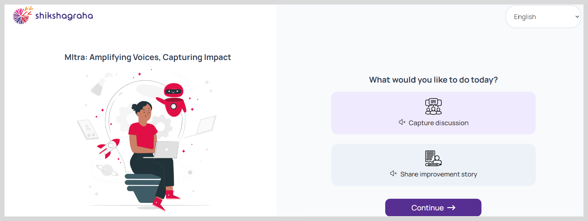

import Admonition from '@theme/Admonition';

# Getting Started with MItra

After receiving the bot link, you can get started by clicking either **Capture discussion** or **Share improvement story** in your preferred language.

* **Capture discussion**: Use this section to capture the discussions related to challenges faced in the community, the steps taken to solve them,
and the improvements that were made.

* **Share improvement story**: Use this section for providing additional information about the stakeholders involved in the discussions of the community's improvement program,
 challenges faced within the community, and the steps taken to address them. MItra then processes these improvement ideas into a structured, shareable document that can be adopted by others facing similar situations.
 The contents are structured into: Problem Statement, Objective, Action steps and Impact.