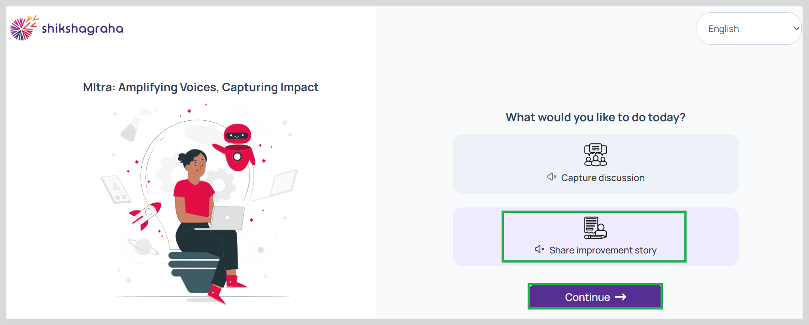
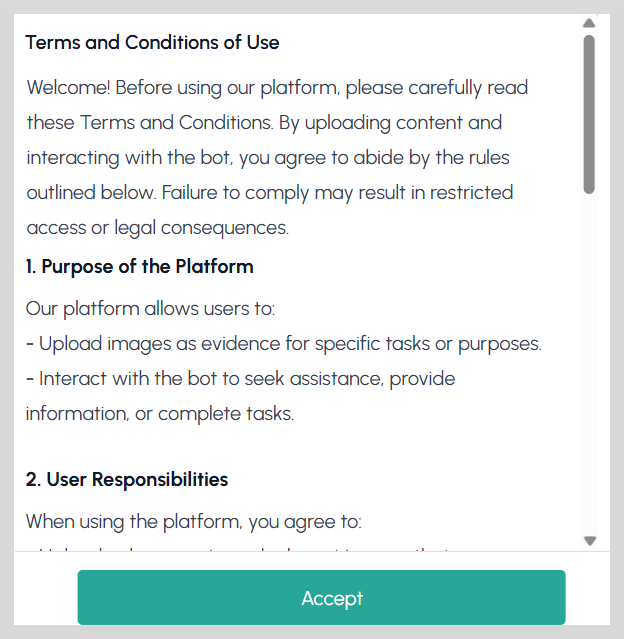
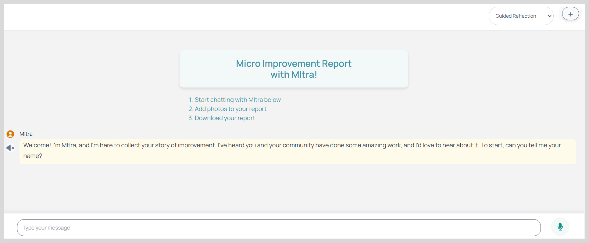
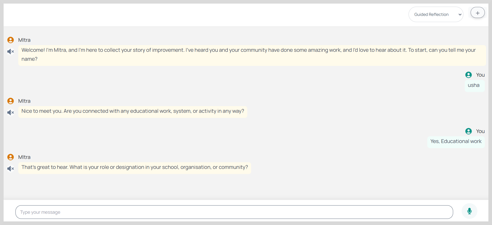
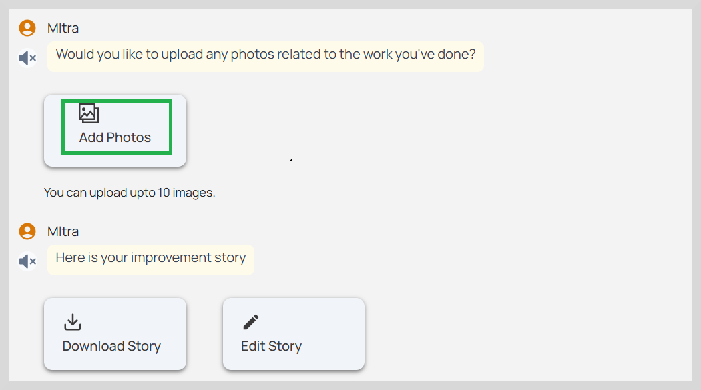

import Admonition from '@theme/Admonition';

# Sharing an Improvement Story

To capture a micro-improvement story, do as follows:

1. On the home page, select your preferred language from the top-right corner of the screen.  

2. Select **Share improvement story** and then click **Continue**.   

3. Click **Accept** on the **Terms and Conditions of Use**.  

4. Start chatting with Mitra to answer a few questions. 

5. You can record the response for a question using any one of the following ways:  

 * To record the improvement story, click the microphone icon and then record your response and then stop recording.

* Type the information in detail in the text box provided and then click **send**.

    <Admonition type="note"> 
    
All questions are to be answered. Do not skip any questions.

     </Admonition>
    
 

    <Admonition type="tip"> 
    
Make sure you provide detailed answers to each question in order to process the data and generate an enriched report.

     </Admonition>
    
 

6. After answering all questions, you can also add photos related to the work you have done.

7. Click **Add Photos** to upload the photos.

    <Admonition type="note"> 
    
A maximum of ten photos can be uploaded..

     </Admonition>
    
 

After uploading the photos you can download the story using the  <a href="downloadimpstory">Download Story</a> option.

