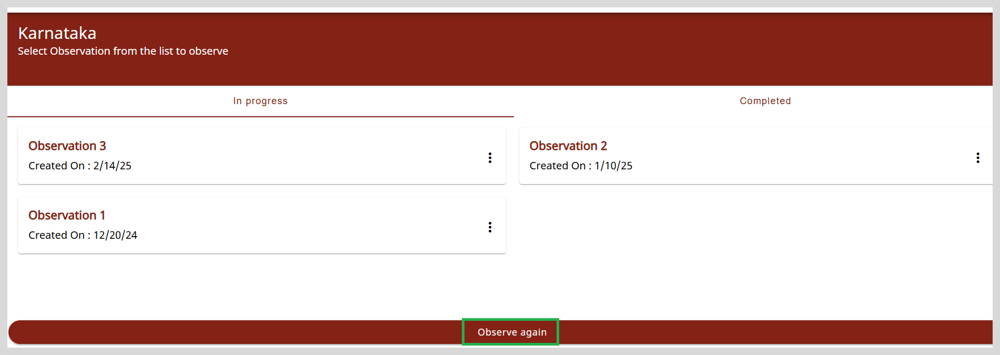
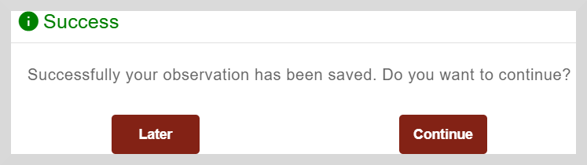

import Admonition from '@theme/Admonition';

# Accessing and Recording Observations Using Rubrics

A rubric-based scoring system helps to identify specific areas or aspects by pinpointing target areas
that need intervention or upskilling. 
Based on the scores obtained from an observation, you can assess the performance level (L1, L2, L3) of an individual or
an institution and also identify the areas that need improvement.

The following section describes how to access and record your observations for comprehensive assessment   
and decision-making.

1. Click the **Observations** tile on the Home page. The **Observations** page appears.

2. On the Observation page, you will find observations that are applicable to your profile and location. You can view, analyze, and submit the responses to those observations that need intervention or improvement.

    

3. Click **LOAD MORE** to view all the Observations listed on the page.

4. Select the Observation for which you want to add your responses.

    

5. Click Karnataka. The list of Observations that are mapped to your profile appears.

  

    <Admonition type="note">
    
The <b>Add state</b> option will change to <b>Add block</b>, <b>Add district</b>, or <b>Add cluster</b>,
    depending on the type of entity and the role that is mapped to the observation.
    In this example, since the observation is targeted to Karnataka state, you will not be able to add any more states.
     However, if the observation you are working on is mapped to a district, block, or cluster, then you will be able to add a district, block, or cluster.

    </Admonition>
   

    

    

    <Admonition type="tip">
    
To create multiple instances of an observation, click <b>Observe again</b>.

    </Admonition>
   

6. Select the Observation that you want to review or respond to. The **Domains** page appears.

     
   

5. Select the domain. After you select a domain, you can view or respond to the questions mentioned under different sections of the domain.

    

    <Admonition type="note"> 
    
Sometimes a domain may not be relevant to the context being assessed.  
       In such a case, you can mark the domain as Not Applicable.
       To do this, click <b>Not Applicable. </b>   
       Provide additional information for marking the domain as not applicable in the space provided. 
       Click <b>Confirm</b> to save the remarks.
             
    </Admonition>
 
  

6. Click **Start**. The **List of sections** page appears.

    

7. Click on any section to open the questionnaire page. Select the relevant option.

    

    <Admonition type="info">
    
To learn more about how to answer the questions, refer to the table given under <a href="startsurvey">Adding Responses to Surveys</a>.

    </Admonition>
   

8. Click **Save** to save your response. A message that says "Successfully your observation has been saved. Do you want to continue?" appears.

    

    Do one of the following:

    * Click **Continue** to answer the questions.
    * Click **Later** to answer the remaining questions when you have time.

9. Click the Question Map icon  to see if all questions are answered.

10. After saving your answers on all the pages, click **Submit**.

     

    <Admonition type="note"> 
    
You cannot edit an observation after submitting it; however, you can view the submitted observations.

     </Admonition>
    
 
        
    
  
 
### Question Map 

Using the question map, you can view the questions that are answered and not answered.

1. Click the Question Map icon  to open the question map.

    

2. Green indicates questions that have been answered while red indicates unanswered questions.  

3. To navigate to a specific question, click on the question number.
