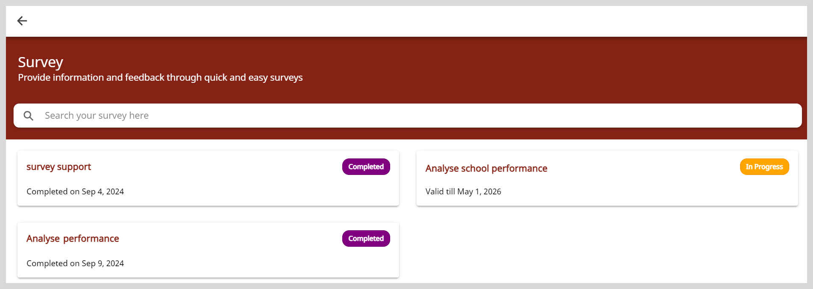

import Admonition from '@theme/Admonition';

# Accessing Surveys

On the Survey page, you will find surveys that you have been assigned. Every survey is valid for a specific period of time.

To access the survey page, click the **Survey** tile on the Home page.

On the Survey page, you can track survey completion from the following statuses:

* Not Started: You are yet to start the survey.
* In Progress: You have added and saved your responses but the survey is yet to be submitted.
* Completed: You have submitted the survey.
* Expired: The survey is no longer valid. You are only allowed to view the survey.

    <Admonition type="tip">   
    For surveys started before the expiration date, you cannot add changes or submit the project after the expiration date.
    </Admonition>
