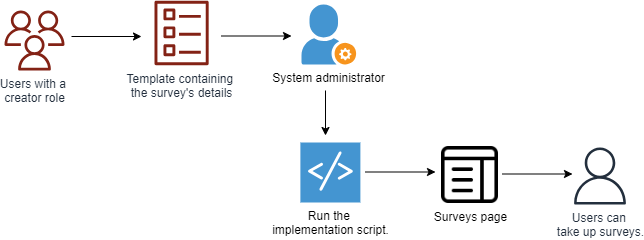

# Creating Questionnaires for Surveys

On the platform, officials can create survey questionnaires. Users can take up the survey for a specific time period and record information and evidence about an area of improvement.

For example, students can take up a survey to evaluate the effectiveness of teaching and learning methodologies at an institution.

## Adding the Survey's Details to the CSV Template

1. Add the survey's information such its objective, description, and time period.

2. Add information to the questionnaire, such as the list of questions, question types, and any hints or tips.

CSV Template for Surveys: https://docs.google.com/spreadsheets/d/1iA0lm_jq0IAgrvZRed8Vdj3uVdtvKAqni-SshiPbCo4/edit?gid=630581096#gid=630581096

## Running the Implementation Script

After receiving the CSV template containing the survey details, system administrators can add the survey to users on the platform.

See the [Implementation Guide](https://github.com/ELEVATE-Project/samiksha-service/tree/main/implementation-script) to learn more.
