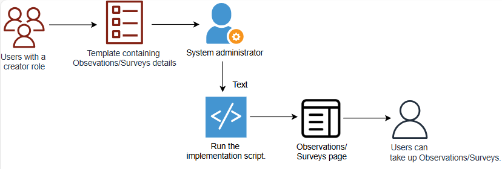

import Admonition from '@theme/Admonition';

# Creating Questionnaires

Users with creator role can create customized questionnaires for conducting surveys. These surveys can be accessed by users for a defined time period, allowing them to collect and record information, including evidence, related to specific areas of improvement. 

For instance, teachers may take a survey to evaluate the effectiveness of teaching and learning methodologies being implemented at their institution.

## Adding the Observation's Details to the CSV template

1. Add the observation's details, such as domain name, weightage, scoring system used for the observation, whether to submit the observation once or multiple times, and section name. 

2. Add information to the questionnaire, such as the list of questions, question types, evidence required to attach for any particular question, and any hints or tips.

Refer to the following links to learn more about Observation templates:

* [With rubric single submission](https://docs.google.com/spreadsheets/d/1FxEzzMqoHGBxTt15kG45xKYgKYXv3TJ2/edit?gid=1547996272#gid=1547996272) : To submit an Observation once.

* [With rubric multiple submission](https://docs.google.com/spreadsheets/d/1GZsXOe754agpsMm3rFTw7nfaNIKC0P7_/edit?gid=409736147#gid=409736147) : To submit an Observation multiple times (observe again).

* [Without rubric single submission](https://docs.google.com/spreadsheets/d/1vHBDvVWWGeeCNeaLdT3ss9u7fJY5T6Ln/edit?gid=1116290010#gid=1116290010) : To submit an Observation without a rubric.

## Adding the Survey's Details to the CSV Template

1. Add the survey's information such its objective, description, and time period.

2. Add information to the questionnaire, such as the list of questions, question types, and any hints or tips.

See the [CSV template](https://docs.google.com/spreadsheets/d/1iA0lm_jq0IAgrvZRed8Vdj3uVdtvKAqni-SshiPbCo4/edit?gid=630581096#gid=630581096) to learn more.

## Running the Implementation Script

After receiving the CSV template containing the survey details, system administrators can add the survey for the users on the platform.

See the [Implementation Guide](https://github.com/ELEVATE-Project/samiksha-service/tree/main/implementation-script) to learn more.
