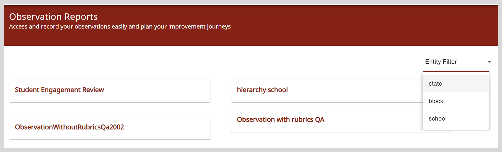
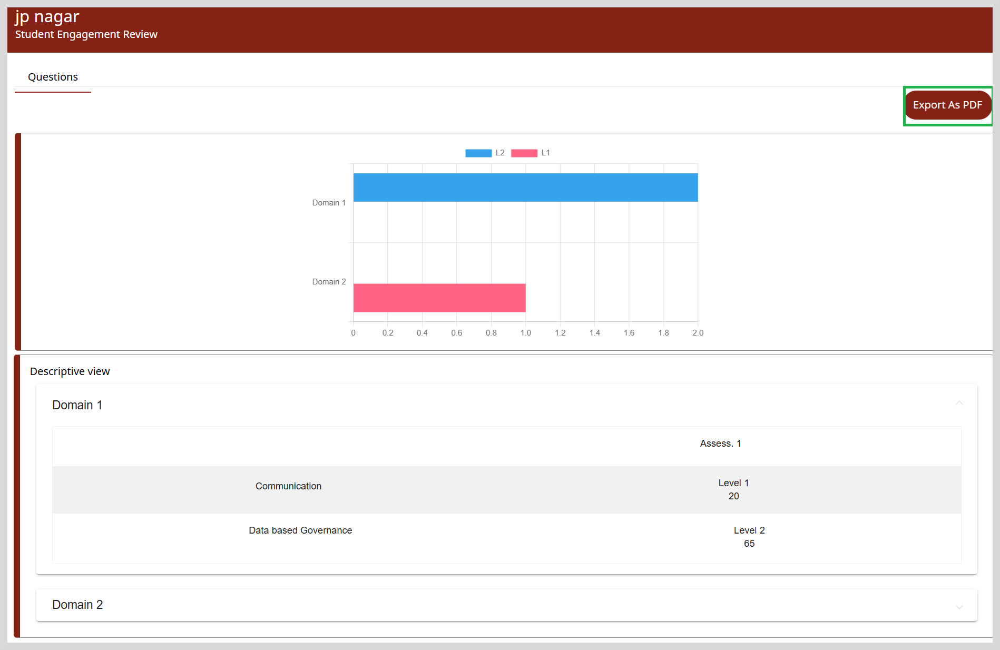
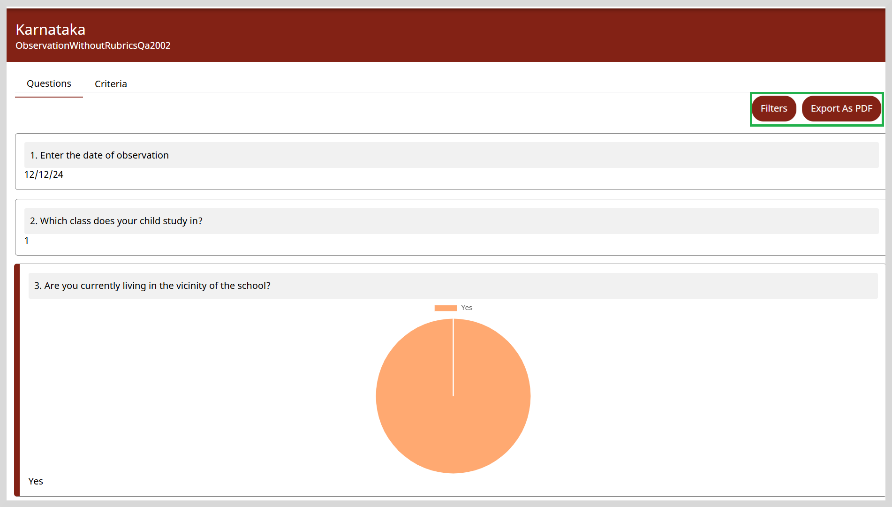
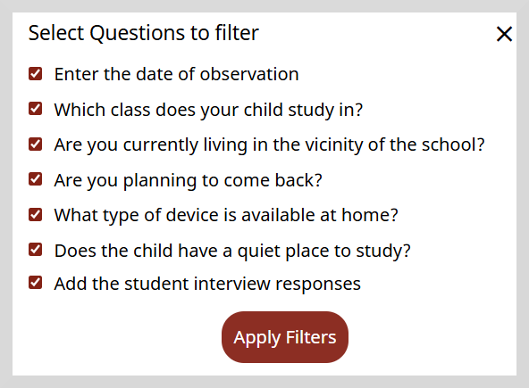

import Admonition from '@theme/Admonition';

# Viewing Observation Reports

On the Observation Reports page, you can view the following:

* **Reports for Observations with rubrics**: This report provides a summary of the assessment details. 
  You can view the criteria and performance level, such as Level 1, Level 2, or Level 3, for each domain.
  

* **Reports for Observations without rubrics**: This report provides the list of submitted observations and their responses.

**To view observation reports, do as follows:**

1. Click the **Reports** tile on the Home page.

2. Go to **Observation Reports**. The Observation Reports page appears.
    
  

    <Admonition type="tip">
    
Use the <b>Entity filter</b> option to display the reports that you want to see, such as state, block, or school level.

    </Admonition>
    

## Observation with Rubrics

You can view the criteria and the assessment details for each domain.

1. Select the observation for which you want to view the assessment details.

  

2. In the **Descriptive view** section, click on the **Domain** to view the rubric scoring
   and the assessment levels for each criteria.

    <Admonition type="tip">
    
To export the report in PDF format, click <b>Export As PDF.</b>

    </Admonition>
    

## Observation without Rubrics

1. Select the observation for which you want to view the saved responses.

  

### Filtering the Report

After selecting an observation report, you can select the specific questions for which you want to view the saved responses.

**To apply filters, do as follows:**

1. Click **Filters** on the top-right corner of the page.

  

2. On the **Select Questions to Filter** dialog box, select one or more questions for which you want to view the response.

3. Click **Apply Filters**.

    <Admonition type="tip">
    
To export the report in PDF format, click <b>Export As PDF</b>

    </Admonition>
    

    