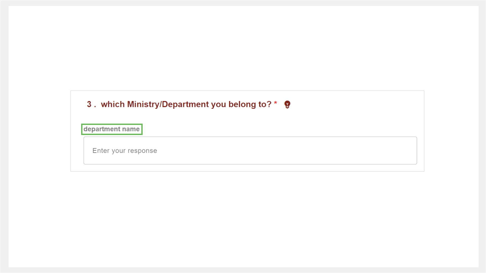
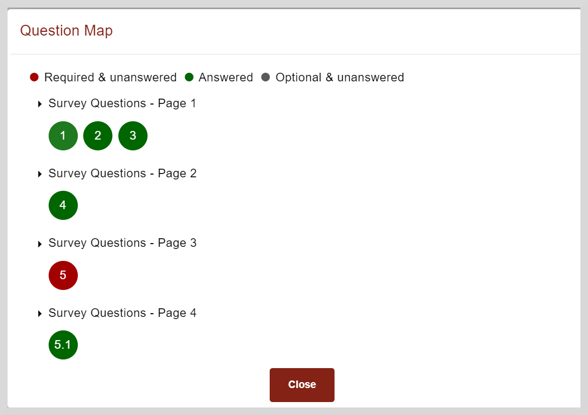

import Admonition from '@theme/Admonition';
import SliderQuestion from './media/sliderquestion.png'
import MatrixQuestion from './media/matrixquestion.png'

# Adding Responses to Surveys

1. Click the **Survey** tile.

2. On the Survey page, click the survey tile to view the questionnaire.

3. To add your responses, refer to the following table:

    <table>
    <tr>
        <th>Type of Question</th>
        <th>Response</th>
    </tr>
    <tr>
        <td>Single-select or multi-select questions</td>
        <td>
Allows you to select one or more options.

In some cases, you will be posed with questions based on the option selected in the previous question.

For example, if you select <i>Yes</i> to a question such as <i>Do you wish to pursue higher education?</i>, you may be posed with questions where you can select the university you want to apply.
</td>
    </tr>
    <tr>
        <td>Slider question</td>
        <td>
Drag the slider to select the numerical value.

</td>
    </tr>
    <tr>
        <td>Date-type question</td>
        <td>Select the date from the date picker.</td>
    </tr>
    <tr>
        <td>Text-type question</td>
        <td>You can enter text that includes letters, numbers, or special characters.</td>
    </tr>
    <tr>
        <td>Matrix question</td>
        <td>
You can define parameters and provide responses for each one. For example, for a question such as <i>How much do you rate the training program?</i> you can add parameters such as topics covered during the training and provide a rating for each parameter.

To add or modify responses to a matrix question, do as follows:
<ol><li>Click <b>Add Matrix</b>.</li><li>Click the parameter and add your responses in formats such as entering text or selecting an option, as specified by the question.</li><li>Click <b>Submit</b>. Your responses are saved.</li></ol>
To delete a parameter, click the <b>Remove instance</b> icon.
</td>
    </tr>
    </table>

4. Optionally, to add evidence that support your response, do as follows:

    1. Click **Add file**.

    2. Read the content policy and select the checkbox to confirm that the uploaded evidence complies with the content policy.

5. Optionally, to provide additional information about your response, click **Add remarks** and add the information.

6. Click **Save**.

7. Click the **Next** button to move to the next page.

    <Admonition type="tip">   
    To review the responses added to the previous page, click the <b>Previous</b> button.
    </Admonition>

## Viewing Hints and Tips

You can gain clarity on the expected response for a question using any one of the following ways:

* View the tip (or prompt) that is provided along with the question.

    

* Click **Hint** .

## Using the Question Map

You can view the Question Map to do the following actions:

* Gain an oversight of the questions that are answered and yet to be answered.

* To navigate to a specific question, click on the question number.

To view the Question map, click **Question Map**.

## Submitting the Responses

After adding and saving your response on all the pages, click **Submit**.