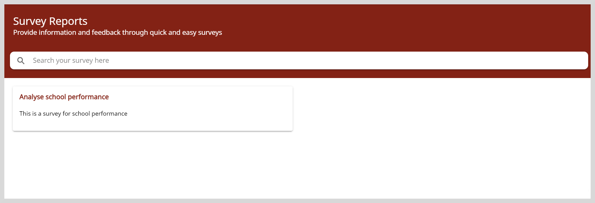

import Admonition from '@theme/Admonition';

# Viewing Survey Reports

On the Survey Reports page, you can view the list of submitted surveys and view the responses that were saved at the time of submission.

**To view survey reports, do as follows:**

1. Click the **Reports** tile.

2. Go to **Survey Reports**. The Survey Reports page appears.

    

3. Select the survey for which you want to the view the saved responses.

## Filtering the Report

After selecting a survey report, you can select the specific questions for which you want to view the saved responses.

**To apply filters, do as follows:**

1. Click the **Filter** button on the top-right corner of the page.

2. On the Questions window, select one or more questions for which you want to view the response and select **Apply Filter**.

    <Admonition type="tip">
    To remove the applied filter, Click the <b>Filter</b> button and select <b>Reset Filter</b>.
    </Admonition>

