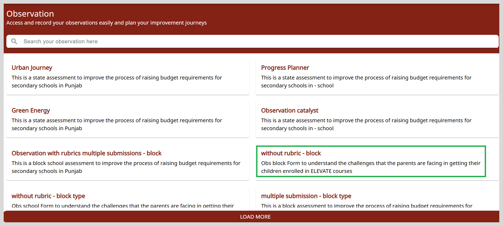
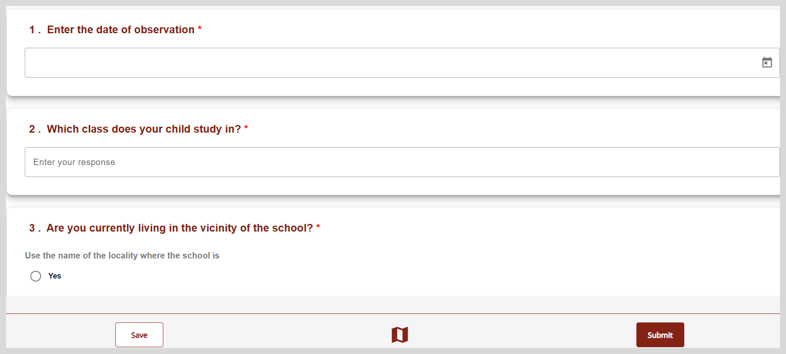

import Admonition from '@theme/Admonition';

# Accessing and Recording Observations without Rubrics

Observations can be done with or without using rubrics. An observation without a rubric is similar to a survey process.
This uses simple forms for collecting data without any predefined set of criteria or standards.

For example:

* An observation of the daily processes and functioning of the school by a block education officer.
* Observation of mid-day meal process in a school by the head master.

The following section describes how to access and record your observations without using a rubric.

1. Click the **Observations** tile.

2. On the Observations page, you will find observations that are applicable to your profile and location. You can view, analyze, and submit the responses to those observations that need intervention or improvement.

    

3. Select an Observation without rubric to view the questionnaire.

     

4. Add your response.

    

    <Admonition type="info">
    
To learn more about how to answer the questions, refer to the table given under <a href="startsurvey">Adding Responses to Surveys</a>.

    </Admonition>
     

5. Click **Save**. A message that says "Successfully your observation has been saved. Do you want to continue?" appears.

    

    Do one of the following:

    * Click **Continue** to answer the questions.
    * Click **Later** to answer the remaining questions when you have time.

6. Click the Question Map icon  to see if all questions are answered.

7. After adding and saving your response on all the pages, click **Submit**.

   

    <Admonition type="note"> 
    
You cannot edit an observation after submitting it; however, you can view the submitted observations.

     </Admonition>
    
 
        

