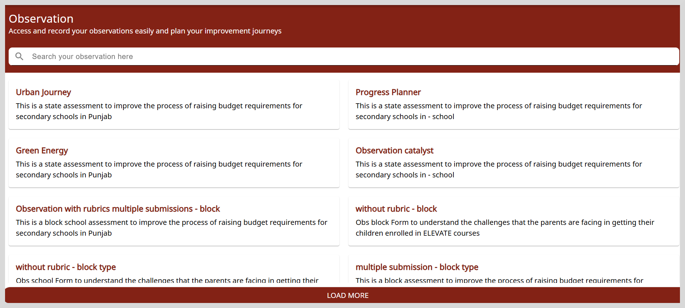
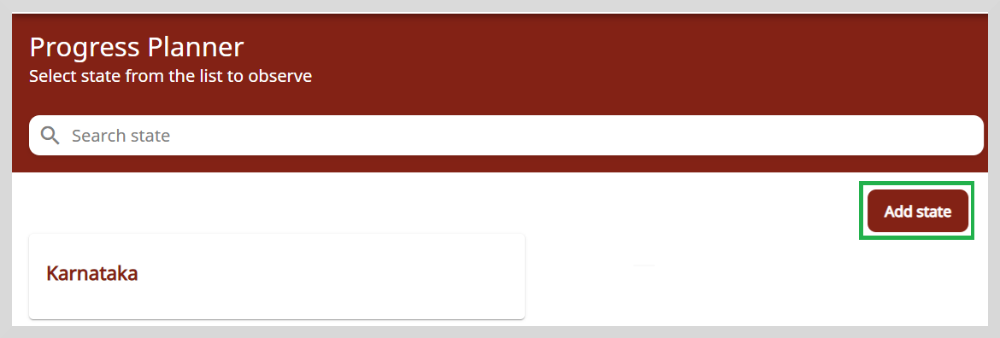
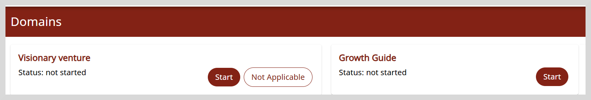
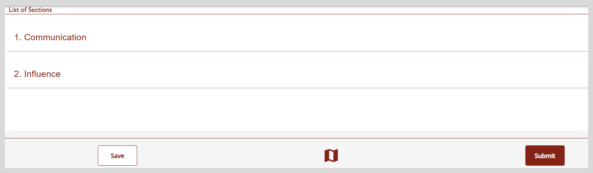
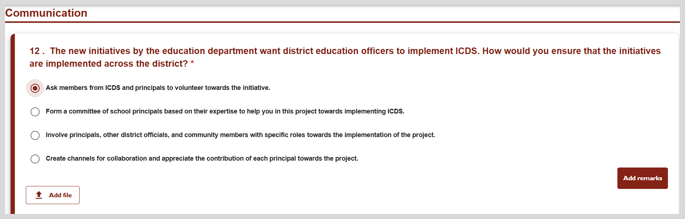
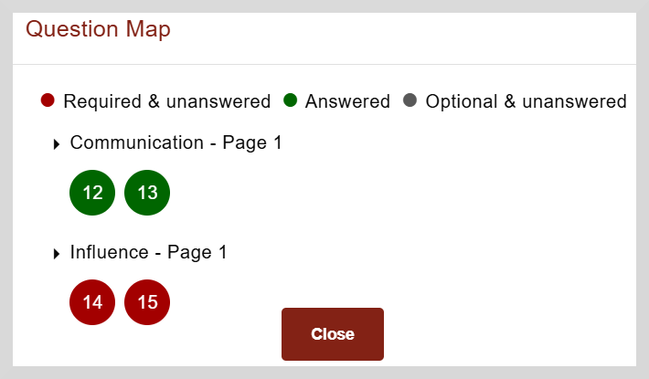

import Admonition from '@theme/Admonition';

# Using Observations with Rubrics for Assessment

A rubric-driven observation contains domains, sections, and criteria-based questions. Each criteria has a rating level mapped to different levels of performance such as Excellent,
Good, Satisfactory, and so on.

**Domains**: Observations can be classified under broad categories such as domains. For example, to evaluate performance of a school, domains could 
include academic or extracurricular activities.

**Sections**: These are subdivisions under domains. For example, under the domain of academic, sections include things such as student performance, library, and so on.

**Criteria-based questions**: These are specific questions within the sections to evaluate the performance.

The following section describes how to access and record your observations for comprehensive assessment and decision-making.

1. Click the **Observations** tile.

2. On the Observations page, you will find observations that are applicable to your profile and location. You can view, analyze, and submit the responses to those observations that need intervention or improvement.

    

3. Select the Observation that you want to review or respond to. The **Domains** page appears.

   <!-- -->

4. Select the domain. After you select a domain, you can view or respond to the questions mentioned under different sections of the domain.

     

  

    <Admonition type="note"> 
    
Sometimes a domain may not be relevant to the context being assessed.  
       In such a case, you can mark the domain as Not Applicable.
       To do this, click <b>Not Applicable. </b>   
       Provide additional information for marking the domain as not applicable in the space provided. 
       Click <b>Confirm</b> to save the remarks.
             
    </Admonition>
 
  
 

5. Click **Start**. The **List of sections** page appears.

    

6. Click any section to open the questionnaire page. Select the relevant option.

    

    To learn more on how to answer the questions, refer to the table given under <a href="startsurvey">Adding Responses to Surveys</a>.

7. Click **Save** to save your response. You can continue to answer remaining questions or do it later when you have time. 

8. Click the Question Map icon  to see if all questions are answered.

9. After saving your answers on all pages, click **Submit**.

### Question Map 

Using the question map, you can view the questions that are answered and not answered.

1. Click the Question Map icon  to open the question map.

    

2. Green indicates questions that have been answered while red indicates unanswered questions.  

3. To navigate to a specific question, click on the question number.
