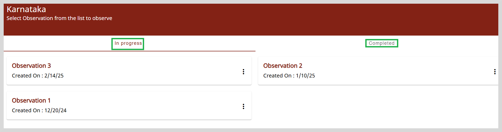
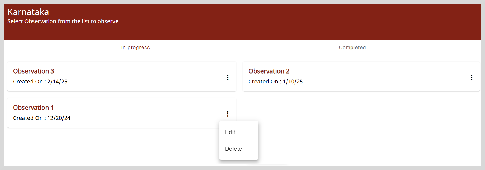
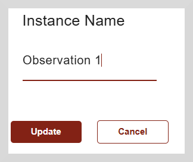
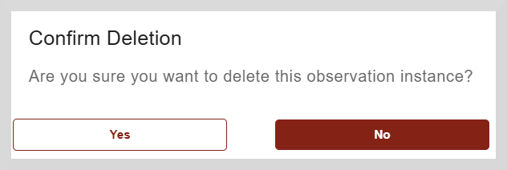

import Admonition from '@theme/Admonition';

# Viewing Observations

To view the observations page, click the **Observations** tile on the Home page.

You can track the observation completion from the following statuses:

* **In Progress**: You have added and saved your responses; however, the observations are yet to be submitted.
* **Completed**: You have submitted the observations.

# Editing Observations

You can rename an observation instance with a meaningful name so it is easy for you to identify it later.

**To edit an observation, do as follows:**

1. Click on the three-dots icon and select **Edit**.

2. Type the new name in the space provided.

3. Click **Update** to update the name.

# Deleting Observations

You can delete an observation if it is no longer required.

**To delete an observation, do as follows:**

1. Click on the three-dots icon and select **Delete**.

    

2. Click **Yes** on the confirmation dialog box to delete the observation.

 

