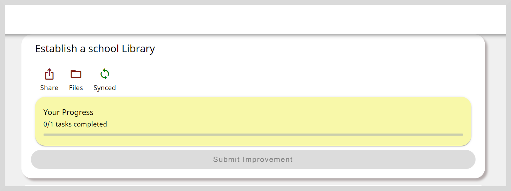

On the Project panel, you can do the following actions:

* Click **Share** to share the project's progress as a PDF file. See [Sharing Projects and Tasks](share-projectsandtasks) to learn more.
* Click **Files** to view the uploaded evidence. See [Viewing the Attached Evidence](submitprojects#viewing-the-attached-evidence) to learn more.
* Click **Sync** to save your project's progress. After clicking **Sync**, it changes to **Synced**.
* View the project's progress and its completion status on the **Progress** bar.

