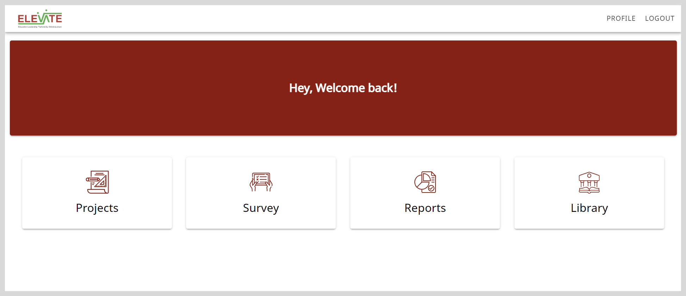

import Admonition from '@theme/Admonition';

<Admonition type="note">

This feature is a part of the <a href="/userservice/settingup-userservice" target="_self">User Service</a>. Follow the instructions on this page if the feature is available on your application.

</Admonition>

**To sign up, do as follows:**

1. Open the application and click **Sign up**.

2. Enter your details:

    * <b>Name</b>
    * <b>Email</b>
        

            <Admonition type="note">
            
Enter a valid email ID.

            </Admonition>
        

    * <b>Password</b>

3. Confirm your password.

4. Click <b>Validate OTP</b>.

5. Click <b>Generate OTP</b>. An OTP is sent to your registered email ID.

6. Enter the OTP.

    <Admonition type="tip">   
    
To receive a new OTP, click <b>Resend OTP</b>.

    </Admonition>

7. Do the following actions:

    * To read the privacy policy, click the <b>Privacy Policy</b> link.
    * To read the terms of service, click the <b>Terms of Service</b> link.

8. Select the checkbox to agree to the terms of service and policy settings.

9. Click <b>Verify and login</b>. The Home page appears.

    

