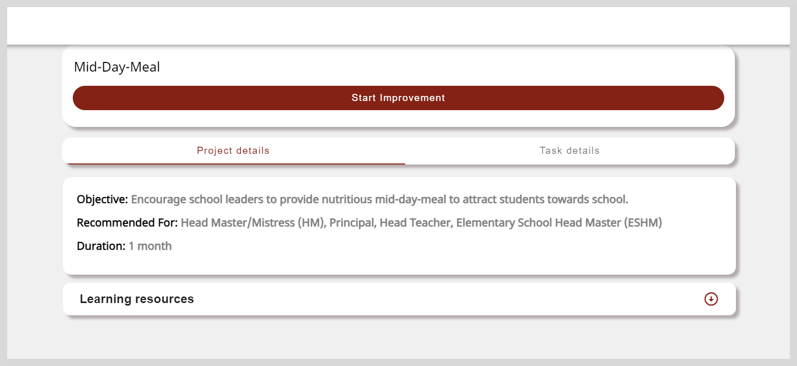

import ProjectPanel from './_projectpanel.mdx'
import Admonition from '@theme/Admonition';

# Accessing Projects

You can view the details of projects using any one of the following methods:

* Using the Project tile
* Using the Project link
* Scanning the Project QR code using the QR code scanner on the mobile app.

    

    <Admonition type="info">
    
For more information on installing the mobile app, see <a href="gettingstarted">Getting Started with Projects</a>.

    </Admonition>
    

## Using the Project tile

To access the Projects page, click the **Project** tile on the Home page. On the Project page, you can find the following tabs:

* **Assigned to me**: Includes projects that are assigned to you by the State. 

* **Discovered by me**:  Includes projects that are not directly assigned to you. When you come across projects through links, QR codes, or **Library**, you can choose to start them. After starting a project, it is listed on the tab.

    

        <Admonition type="info">   
        
See <a href="discoverprojects">Discovering Projects</a> to learn more.

        </Admonition>
    

## Viewing the Project's Details

From the list of projects, select a project of your choice. You can view the following details on the **Project details** tab:

* Project's information such as objective, recommended for, and duration.

* Learning resources such as links or files that provide more clarity and understanding about the project.

* If the Project includes certificates, the criteria for earning certificates are specified.

## Starting Your Assigned Projects

1. On the **Assigned to me** tab, select an assigned project of your choice.

2. If you wish to proceed with the selected assigned project, click **Start Improvement**.

    

3. If the project includes a certificate, verify your profile details and do as follows:
   * Click **Confirm**.
   * Click **Edit** to update your details on the Profile page.

## Accessing the Project Panel

<ProjectPanel />

    

