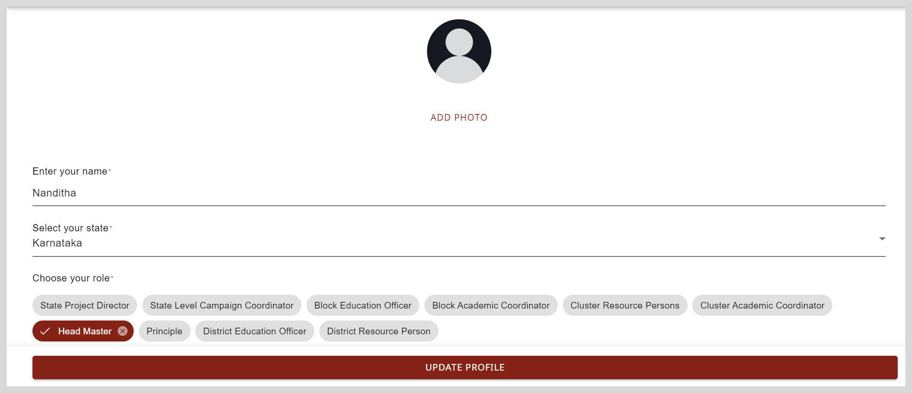

import Admonition from '@theme/Admonition';

# Updating Your Profile to Access Projects

You profile information is necessary for the following:

* Assigning projects based on your role or location.

* Adding details (such as the recipient's name) to the certificates that are provided to you after completing a project.

<Admonition type="note">   
To access your projects, your profile must be complete.
</Admonition>

**To update your profile, do as follows:**

1. Click **Profile** on the top-right corner of the Home page.

2. Click **Edit Profile** on the Profile page.

3. Optionally, to update your profile picture, do any one of the following actions:

    * Click **Add Photo** and select the image.

    * To remove an existing image, click **Remove Photo**.

4. Enter your name.

5. Select an option to specify details such as your role, state, and district.

    

5. Click **Update Profile**. Your profile is updated.

