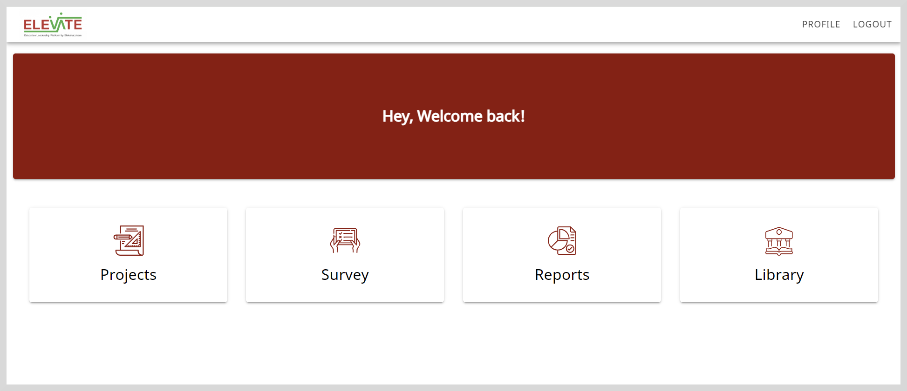
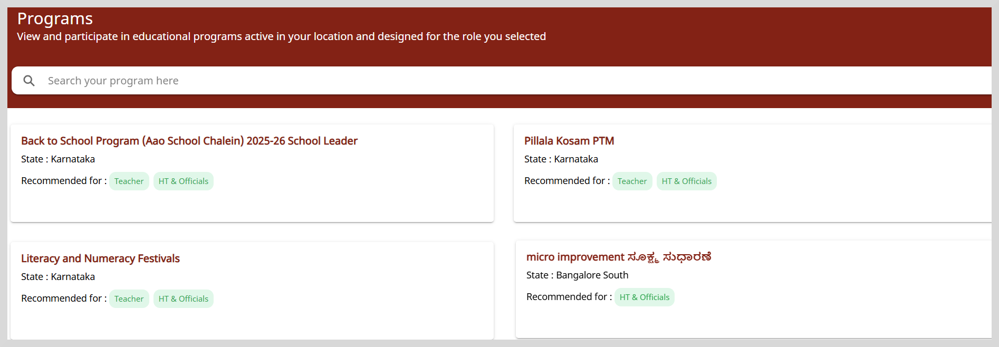

import Admonition from '@theme/Admonition';

# Overview

A program is a structured initiative designed to achieve specific outcomes. It serves as an overarching framework under which multiple activities, such as projects, observations and surveys can be organized, executed, and tracked.
Programs are created and managed by program managers and may address specific themes. Each program can be tailored to different user groups based on roles, geography, or thematic focus.

## Key Attributes of a Program

The following table describes the key attributes of a program.

<table>
<tr>
    <th>Attributes</th>
    <th>Description</th>
</tr>
<tr>
    <td>Program title</td>
    <td>Name of the program that indicates the focus or goal of the initiative.</td>
</tr>
<tr>
    <td>Program objective/description</td>
    <td>A concise summary of the purpose, goals, and intended outcomes.</td>
</tr>
<tr>
    <td>Theme/Category</td>
    <td>Define the thematic focus of the program.</td>
</tr>
<tr>
    <td>Recommended for</td>
    <td>Indicates the specific user group(s) the program is intended for.</td>
</tr>
<tr>
    <td>Geography</td>
    <td>The region or state where the program is being implemented.</td>
</tr>
<tr>
    <td>Program duration</td>
    <td>Define the start date and the end date of the program.</td>
</tr>
</table>

## Accessing Programs

You can access programs using the **Programs** tile on the Home page.

Select the **Programs** tile to view the programs mapped to your role and location. The Programs page appears as shown in the following figure.

## Adding the Program's details to the CSV Template

1. Add the program's information, such as program title, program description, who can access the program, and duration of the program.

2. Add the resource details to be mapped to the program. Define roles and sub-roles for who can access the resource and its duration.

3. Add the program manager's details.

See the [CSV template](https://docs.google.com/spreadsheets/d/1mivwHzxrZyLHcM8ApOAeYIRLip-jJJXJ/edit?gid=1915353432#gid=1915353432) to learn more.

## Running the Implementation Script

After receiving the CSV template containing the program's details, system administrators can make the program available to users on the platform.

See the [Implementation Guide](https://github.com/ELEVATE-Project/project-service/tree/main/Project-Service-implementation-Script) to learn more.

