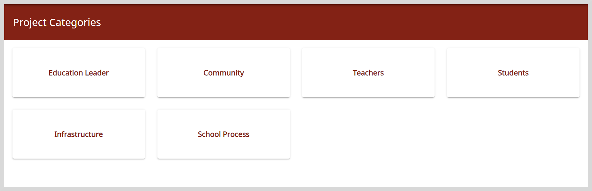

import Admonition from '@theme/Admonition';

# Project Library

In the Library, you can find various project templates organized by category.

**To view the Library, do as follows:**

1. On the Home page, click the **Library** tile.

    

2. Select a project category. The list of projects belonging to the selected category appears.

    

    <Admonition type="info">
    To start projects that you have found on the Library, see <a href="discoverprojects#starting-your-discovered-projects">Discovering Projects</a>.
    </Admonition>
    
