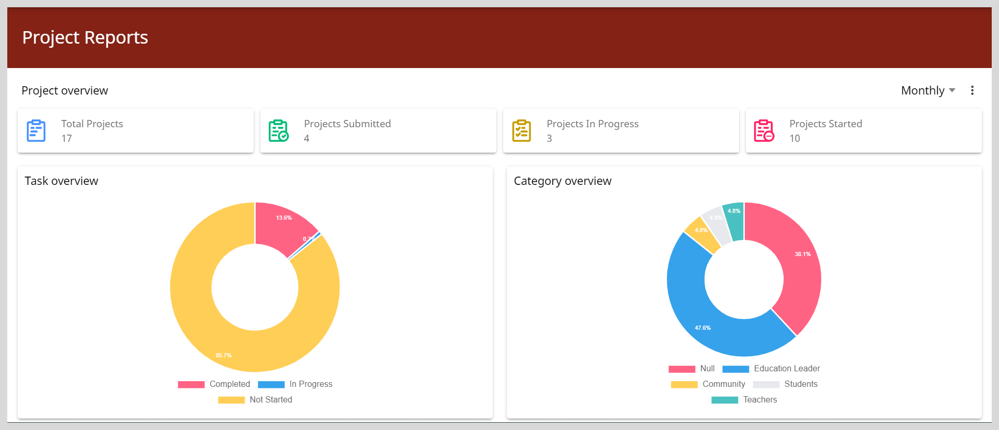

import Admonition from '@theme/Admonition';

# Accessing Project Reports

1. Click the **Reports** tile.

2. Go to **Improvement Project Reports**. The Project Reports page appears.

3. Review you project summary.

    

    <Admonition type="tip">
    <ul>
    <li>To view the project's progress for a specific time frame, select <b>Monthly</b>, <b>Weekly</b>, or <b>Quarterly</b> using the Timeframe dropdown.</li>
    <li>To download the report as a PDF file, go to <b>More options</b> on the top-right corner and select <b>Download</b>.</li>
    </ul> 
    </Admonition>
    

    

## Sharing Reports

To can share the project report as a PDF, do as follows:

1. Go to <b>More options</b> on the top-right corner and select <b>Share</b>.

2. To obtain the shareable link, click **Copy**.

3. Share the link with your peers or superiors.

    <Admonition type="tip">
    
After clicking on the shared link, they can download a PDF file of the project report.

    </Admonition>

