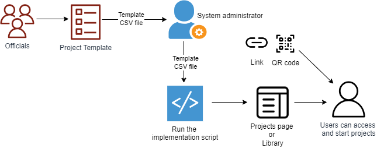

import ProductName from './_projects.mdx';

# Creating Project Templates

Users with a creator role can create project templates targeting a specific category. For example, for a category such as school process, a project that target improvements in teaching and learning approaches can be created. 

Users (such as teachers or principal) can then access the project templates and use it to track their improvement activities.

## Adding the Program's details to the CSV Template

1. Add the program's information, such as program title, program description, who can access the program, and duration of the program.

2. Add the resource details such as roles and sub-roles on who can access and the duration of the resource.

3. Add the Program manager details

See the [CSV template](https://docs.google.com/spreadsheets/d/1mivwHzxrZyLHcM8ApOAeYIRLip-jJJXJ/edit?gid=1915353432#gid=1915353432) to learn more.

## Adding the Project's details to the CSV Template

1. Add the project's information such as its objective, duration, and category.

2. Add the tasks or actionable steps required to complete the project.

3. Optionally, to reward users with certificates, add the certificate's details and the criteria for earning the certificate.

See the [CSV template](https://docs.google.com/spreadsheets/d/1Y5j6tn_Pgo5ZhcHshsLkCRQDGkgZ7GBmPnhfGELQ_EY/edit?gid=651988305#gid=651988305) to learn more.

## Running the Implementation Script

After receiving the CSV template containing the project's details, system administrators can make the project available to users on the platform.

See the [Implementation Guide](https://github.com/ELEVATE-Project/project-service/tree/main/Project-Service-implementation-Script) to learn more.

