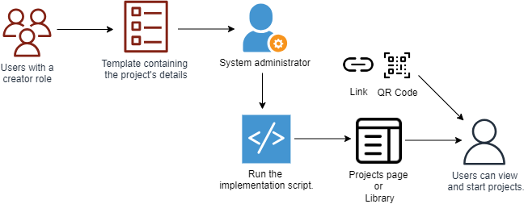

import ProductName from './_projects.mdx';

# Creating Project Templates

On the platform, officials can create project templates targeting a specific category. For example, for a category such as school process, a project that target improvements in teaching and learning approaches can be created. 

Users (such as teachers or principal) can then access the project templates and use it to track their improvement activities.

## Adding the Project's Details to the CSV Template

1. Add the project's information such its objective, duration, and category.

2. Add the tasks or actionable steps required to complete the project.

3. Optionally, to reward users with certificates, add the certificate's details and the criteria for earning the certificate.

4. Download the template as a CSV file.

CSV Template:

## Implementing Projects

After receiving the CSV template containing the project's details, system administrators can upload the project to the platform and make it available to users.

See the Implementation Guide to learn more.

