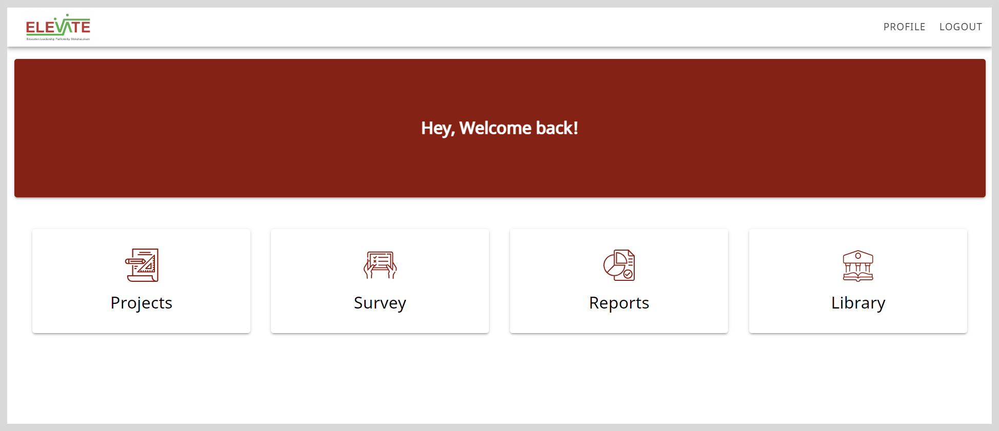

import ProductName from './_projects.mdx';
import Admonition from '@theme/Admonition';

# Signing up on Projects

To create projects and manage your assigned projects and tasks, you must sign up to create an account.

1. Open <ProductName /> and click **Sign up**.

2. Enter your details:

    * <b>Name</b>
    * <b>Email</b>
        

            <Admonition type="note">
            
Enter a valid email ID.

            </Admonition>
        

    * <b>Password</b>

3. Click <b>Validate OTP</b>.

4. Click <b>Generate OTP</b>. An OTP is sent to your registered email ID.

5. Enter the OTP.

    <Admonition type="tip">   
    
To receive a new OTP, click <b>Resend OTP</b>.

    </Admonition>

6. Do the following actions:

    * To read the privacy policy, click the <b>Privacy Policy</b> link.
    * To read the terms of service, click the <b>Terms of Service</b> link.

7. Select the checkbox to agree to the terms of service and policy settings.

8. Click <b>Verify and login</b>. The Home page appears.

    

## Logging out

1. Click **Logout** on the top-right corner of the Home page.

2. Select **Logout** on the confirmation dialog.
