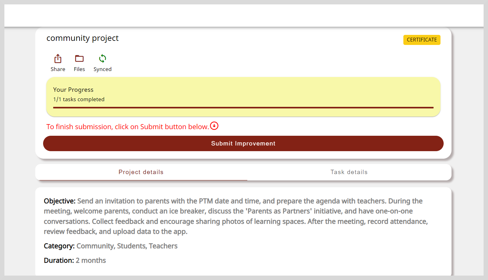
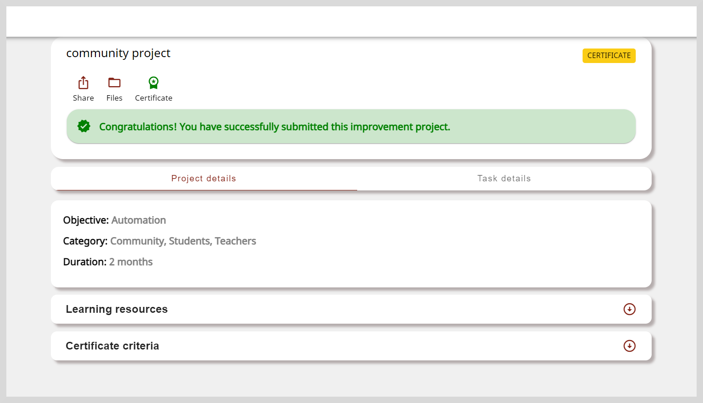

import Admonition from '@theme/Admonition';

# Submitting Projects

After updating all tasks' or subtasks' status as *Complete*, you can submit the project.

<Admonition type="info">

For more information on accessing the Project details page, see any one of the following sections:

<ul>
<li><a href="accessprojects">Accessing projects</a></li>
<li><a href="discoverprojects">Discovering projects</a></li>
</ul> 
</Admonition>

<Admonition type="note">

If the project includes a certificate, ensure that you have met the certificate criteria before submitting the project. For example, check the number of task-level or project-level evidence you must submit to earn a certificate.

To verify the task-level evidence before submitting the project, see <a href="#viewing-the-attached-evidence">Viewing the Attached Evidence</a>.

</Admonition>

**To submit your project do as follows:**

1. Click **Submit Improvement** on the Project details page.

    

2. Click **Submit Improvement**.

    

    <Admonition type="info">
    To add project-level evidence before submitting the project, see <a href="#viewing-the-attached-evidence">Viewing the Attached Evidence</a>
    </Admonition>
    

3. Click **Submit** on the confirmation dialog. Your project is submitted.

    

## Adding Project-Level Evidence

Before submitting the project, you can add evidence that support your project completion status.

**To add project-level, do as follows:**

1. Optionally, you can add remarks about your task's status in the <b>Add remarks</b> box.

2. Click the **Images**, **Files**, **Links**, or **Videos** tile and select the file.

3. Read the **Content Policy** and select the checkbox to confirm that the uploaded evidence complies with the content policy.

4. Click **Upload**.

5. Do one of the following:

    * Select the file to upload.
    * To attach links, paste the link in the **Add link** box and click **Save**.

6. Click **Submit Improvement**.

7. Click **Submit** on the confirmation dialog. Your project is submitted.

    

## Viewing the Attached Evidence

You can do the following actions:

* Before submitting the project, verify the attached task-level evidence.

    

    <Admonition type="info">
    
For more information on adding task-level evidence, see <a href="tasks#adding-task-level-evidence">Viewing the Attached Evidence</a>.

    </Admonition>
    

* After submitting the project, view the attached project-level evidence.

**To view the attached evidences, do as follows**:

1. On the Project details page, click **Files**.

2. On the Attachments page, based on the type of evidence added, click the relevant tab to view the attached evidence.