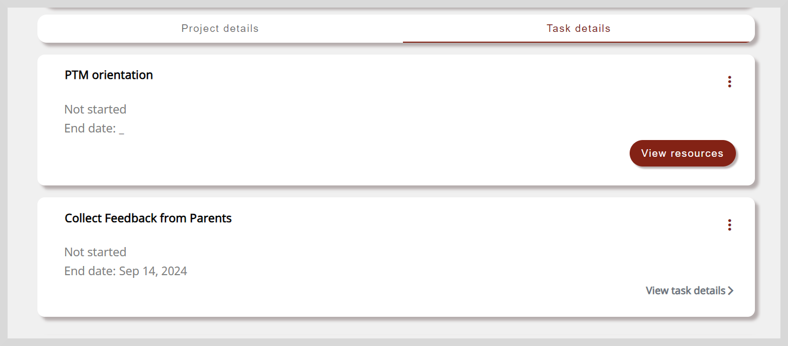
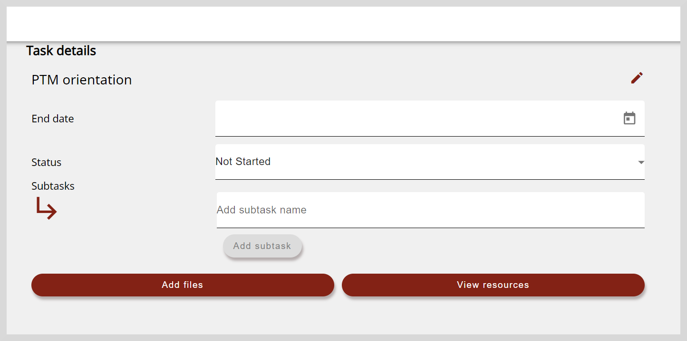
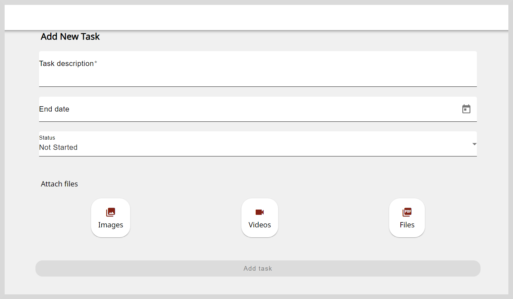
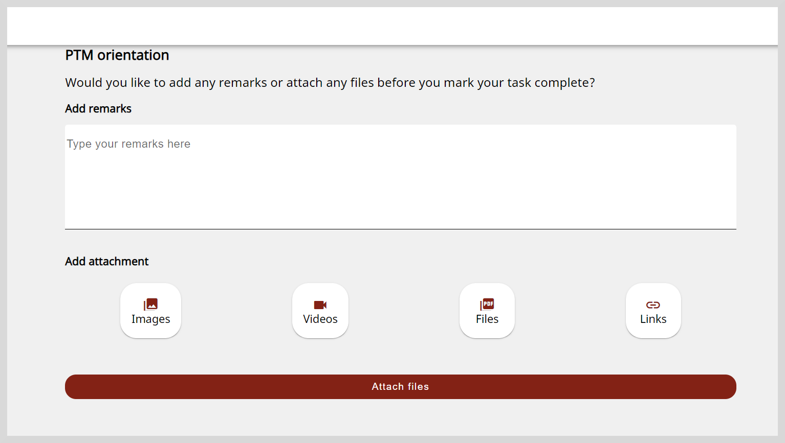

import Admonition from '@theme/Admonition';

# Managing Tasks

Improvement projects may include one or more tasks (or actions) that you must complete.

After starting your improvement projects, you can do the following:

* View task's resources

* Add new tasks and subtasks to the project

* Update or delete tasks and subtasks

<Admonition type="note">

After carrying out any project management activities such as creating and updating tasks, you must save the changes before leaving the project details page.

To save the changes, click <b>Sync</b> on the project details page.

</Admonition>

## Viewing Your Improvement Projects

After starting an improvement project, you can find the project using any one of the following methods:

* Click the shared link.

* Scan the shared QR code using the mobile app.
    

    <Admonition type="info">
    
For more information on installing the mobile app, see <a href="gettingstarted">Getting Started with Projects</a>.

    </Admonition>
    

* Do as follows:

    1. Click the **Projects** tile.
    2. Go to the **Assigned to me** or **Discovered by me** tab.
    3. Select the project.
        

        <Admonition type="info">
        
To learn more, see the following sections:

        <ul>
        <li><a href="assignedprojects">Accessing Assigned projects</a></li>
        <li><a href="discoverprojects">Discovering projects</a></li>
        </ul>
        </Admonition>
        

## Viewing Learning Resources

To gain better clarity about the task, you can refer to the learning resources provided for the task.

1. On the Project details page, go to the **Task details** tab.

2. To view the learning resources page, do any one of the following actions:

    * Click **View resources**.

        

    * Click the task tile and click **View resources**.

           
 
## Adding New Tasks

You can define your own necessary tasks to achieve your project's goals.

1. On the Project details page, go to the **Task details** tab.

2. Click **Add your own task** button. The Add New Task page appears.

    

3. Enter the task's details such as name in the **Task description** box.

4. Optionally, you can add the following information:

    <table>
    <tr>
    <th>Action</th>
    <th>Steps</th>
    </tr>
    <tr>
    <td>Set the date of completion</td>
    <td><ol><li>Click <b>End date</b> box.</li><li>Select a date from the date picker.</li></ol></td>
    </tr>
    <tr>
    <td>Add the task's status</td>
    <td>
To specify the project's progress, click the <b>Status</b> dropdown and select any one of the following status for the task:
<ol><li>Not Started</li><li>In Progress</li><li>Completed</li></ol></td>
    </tr>
    <tr>
    <td>Create subtasks</td>
    <td>
Complex tasks can be further divided into subtasks. To create subtasks, do as follows:
<ol><li></li></ol></td>
    </tr>
    <tr>
    <td>Add the subtasks' status</td>
    <td>If the project contains subtasks, you can specify you progress as follows:</td>
    </tr>
    <tr>
    <td>Upload evidences</td>
    <td>
To upload evidence that support the task's completion status, do as follows:
<ol><li>Select the <b>Image</b>, <b>Videos</b>, or <b>Files</b> tab.</li><li>Read the <b>Content Policy</b> and select the checkbox to agree to the content policy.</li><li>Select the file.</li></ol></td>
    </tr>
    </table>

5. Click **Add task**. The task is created and listed in the **Task details** tab.

## Updating Tasks

1. To view the Task details page, do one of the following actions:

    * Go to **More Options** on the top-right corner and select **Edit**.
    * Click the task tile.

    

2. Update the task as follows:

    <table>
    <tr>
    <th>Action</th>
    <th>Steps</th>
    </tr>
    <tr>
    <td>Change the task's description</td>
    <td>
If projects include tasks that are optional, you can change the task's description as follows:
<ol><li>Click the <b>Edit</b> icon.</li><li>Change the task's description and click <b>Save</b>.</li></ol></td>
    </tr>
    <tr>
    <td>Set or update the date of completion</td>
    <td><ol><li>Click <b>End date</b> box.</li><li>Select a date from the date picker.</li></ol></td>
    </tr>
    <tr>
    <td>Update the task's status</td>
    <td>
To specify the project's progress, click the <b>Status</b> dropdown and select any one of the following status for the task:
<ul><li>Not Started</li><li>In Progress</li><li>Completed</li></ul></td>
    </tr>
    <tr>
    <td>Update the subtask's name</td>
    <td><ol><li>Click the subtask's name.</li><li>Enter the new name and click <b>Save</b>.</li></ol></td>
    </tr>
    <tr>
    <td>Set or update the subtask's date of completion</td>
    <td><ol><li>Click the Date box.</li><li>Select a date from the date picker.</li></ol></td>
    </tr>
    <tr>
    <td>Update the subtask's status</td>
    <td>
If the project contains subtasks, you can specify the project's progress as follows:
<ol><li>Click the Status dropdown.</li><li>select any one of the following status for the task:<ul><li>Not Started</li><li>In Progress</li><li>Completed</li></ul></li></ol></td>
    </tr>
    </table>

### Uploading Evidence

To upload evidence that support your tasks's completion status, do as follows:

1. Click <b>Add files</b>.

2. Read the <b>Content Policy</b> and select the checkbox to comply with the content policy.

3. Click <b>Upload</b>. 

    

4. Optionally, you can add remarks about your task's status in the <b>Add remarks</b> box.

5. To upload files, click the <b>Images</b>, <b>Files</b>, or <b>Videos</b> tile and select the file. The file is uploaded.

6. To attach links, do as follows:

    1. Click **Links**.
    2. Paste the link and click **Save**.

7. Click **Attach files**. To view the attached evidence, click **Files** on the Project details page.

## Deleting Tasks

If projects include tasks that are optional, you can delete them if they are no longer required.

**To delete tasks, do as follows:**

1. Go to **More Options** in the top-right corner and select **Delete**.

2. Click **Yes** on the confirmation dialog. The task is removed from the **Task details** tab.

## Deleting Subtasks

If your project include subtasks, you can delete them if they are no longer required.

**To delete subtasks, do as follows:**

1. Click the task tile. The task details page.

2. Click the **Delete** icon on the subtask tile. The subtask is removed from the task details page.