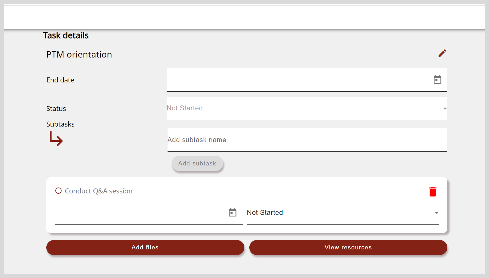

import Admonition from '@theme/Admonition';

# Managing Tasks

Improvement projects may include one or more tasks (or actions) that you must complete. 

On the **Task details** tab, you can do the following actions:

* View the task's resources.

* Add new tasks and subtasks to the project.

* View mandatory and non-mandatory tasks.

    

    <Admonition type="tip">
    Projects may include tasks that are mandatory or non-mandatory.To identify tasks that are mandatory, look for the <i>Mandatory</i> label on the task tile.
    </Admonition>
    

* Share mandatory and non-mandatory tasks. See [Sharing Projects and Tasks](share-projectsandtasks) to learn more.

* Update or delete non-mandatory tasks.

<Admonition type="info">

For more information on viewing projects, see any one of the following sections:

<ul>
<li><a href="viewprojects">Viewing Assigned projects</a></li>
<li><a href="discoverprojects">Discovering projects</a></li>
</ul>
</Admonition>

## Viewing Learning Resources

To gain better clarity about the task, you can refer to the learning resources provided for the task.

1. On the Project details page, go to the **Task details** tab.

2. To view the learning resources page, do any one of the following actions:

    * Click **View resources**.

        

    * Click the task tile and click **View resources**.

           
 
## Adding New Tasks

You can define your own necessary tasks to achieve your project's goals.

1. On the Project details page, go to the **Task details** tab.

2. Click **Add your own task** button. The Add New Task page appears.

    

3. Enter the task's details such as name in the **Task description** box.

4. Optionally, you can specify additional task details such as the date of completion and the task's status as per the following table:

    <table>
    <tr>
    <th>Action</th>
    <th>Steps</th>
    </tr>
    <tr>
    <td>Set the date of completion</td>
    <td><ol><li>Click <b>End date</b> box.</li><li>Select a date from the date picker.</li></ol></td>
    </tr>
    <tr>
    <td>Add the task's status</td>
    <td>
To specify the project's progress, click the <b>Status</b> dropdown and select any one of the following statuses for the task:
<ol><li>Not Started</li><li>In Progress</li><li>Completed</li></ol></td>
    </tr>
    </table>

5. Optionally, to upload files that support the task's completion status, do as follows:

    1. Select the **Image**, **Videos**, or **Files** tab.
    
    2. Read the **Content Policy** and select the checkbox to confirm that the uploaded evidence complies with the content policy.
    
    3. Select the file.

6. Click **Add task**. The task is created and listed in the **Task details** tab.

7. To save the changes, go to the project details page and click <b>Sync</b>.

## Updating Tasks

<Admonition type="note">

Only non-mandatory tasks can be edited or deleted.

</Admonition>

1. To view the Task details page, do one of the following actions:

    * Go to **More Options**  on the top-right corner of the task tile and select **Edit**.
    * Click the task tile.

    

2. Update the task as follows:

    <table>
    <tr>
    <th>Action</th>
    <th>Steps</th>
    </tr>
    <tr>
    <td>Change the task's description</td>
    <td>
If projects include tasks that are optional, you can change the task's description as follows:
<ol><li>Click the <b>Edit</b> icon located next to project's description.</li><li>Change the task's description and click <b>Save</b>.</li></ol></td>
    </tr>
    <tr>
    <td>Set or update the date of completion</td>
    <td><ol><li>Click <b>End date</b> box.</li><li>Select a date from the date picker.</li></ol></td>
    </tr>
    <tr>
    <td>Update the task's status</td>
    <td>
To specify the project's progress, click the <b>Status</b> dropdown and select any one of the following statuses:
<ul><li>Not Started</li><li>In Progress</li><li>Completed</li></ul></td>
    </tr>
    </table>

3. To save the changes, go to the project details page and click <b>Sync</b>.

### Managing Subtasks

Complex tasks can be further divided into subtasks. After creating subtasks, you can specify the project's progress by updating the status of the subtasks.

1. To add or update subtasks, do the following actions:

    <table>
    <tr>
    <th>Action</th>
    <th>Steps</th>
    </tr>
    <tr>
    <td>Create subtasks</td>
    <td><ol><li>Enter the subtask's name in the <b>Subtask</b> box.</li><li>Click <b>Add subtask</b>. The subtask is listed on the Task details page.</li></ol></td>
    </tr>
    <tr>
    <td>Update the subtask's name</td>
    <td><ol><li>Click the subtask's name.</li><li>Enter the new name and click <b>Save</b>.</li></ol></td>
    </tr>
    <tr>
    <td>Set or update the subtask's date of completion</td>
    <td><ol><li>Click the Date box.</li><li>Select a date from the date picker.</li></ol></td>
    </tr>
    <tr>
    <td>Update the subtask's status</td>
    <td><ol><li>Click the Status dropdown.</li><li>Select any one of the following statuses for the task:<ul><li>Not Started</li><li>In Progress</li><li>Completed</li></ul></li></ol></td>
    </tr>
    </table>

    

2. To save the changes, go to the project details page and click <b>Sync</b>.

### Adding Task-Level Evidence

To add evidence that support your tasks's completion status, do as follows:

1. Click <b>Add files</b>.

2. Read the <b>Content Policy</b> and select the checkbox to confirm that the uploaded evidence complies with the content policy.

3. Click <b>Upload</b>. 

    

4. Optionally, you can add remarks about your task's status in the <b>Add remarks</b> box.

5. To upload files, click the <b>Images</b>, <b>Files</b>, or <b>Videos</b> tile and select the file. The file is uploaded.

6. To attach links, do as follows:

    1. Click **Links**.
    2. Paste the link and click **Save**.

7. Click **Attach files**. To view the attached evidence, click **Files** on the Project details page.

8. To save the changes, go to the project details page and click <b>Sync</b>.

## Deleting Tasks

<Admonition type="note">

Only non-mandatory tasks can be edited or deleted.

</Admonition>

If projects include tasks that are optional, you can delete them if they are no longer required.

**To delete tasks, do as follows:**

1. Go to **More Options**  on the top-right corner of the task tile and select **Delete**.

2. Click **Yes** on the confirmation dialog. The task is removed from the **Task details** tab.

3. To save the changes, go to the project details page and click <b>Sync</b>.

## Deleting Subtasks

If your project include subtasks, you can delete them if they are no longer required.

**To delete subtasks, do as follows:**

1. Click the task tile. The task details page.

2. Click the **Delete** icon on the subtask tile. The subtask is removed from the task details page.

3. To save the changes, go to the project details page and click <b>Sync</b>.