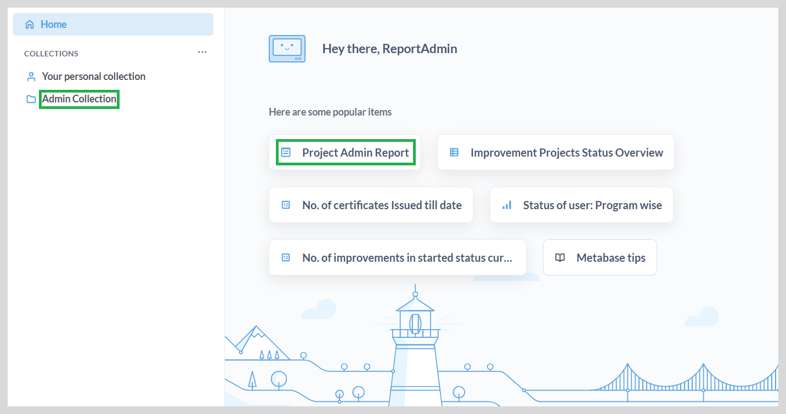
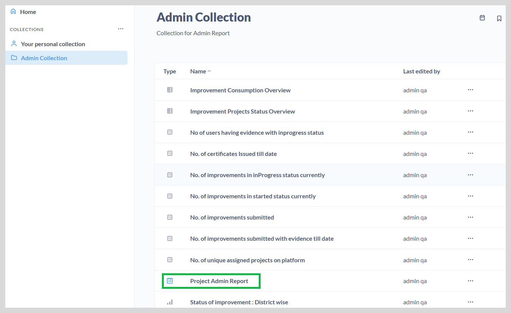
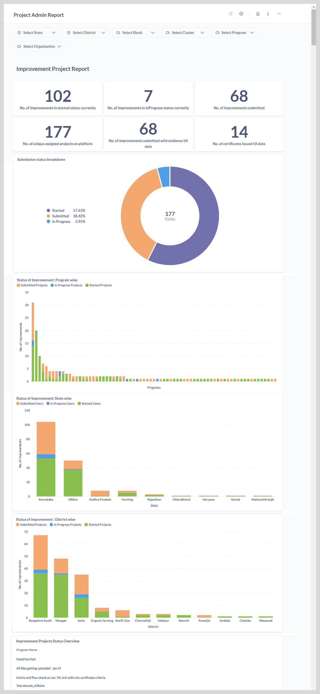

import Admonition from '@theme/Admonition';

# Project Admin Report

After logging in to reports, the **Project Admin Report** appears. This landing page provides administrators access to
all the state, district, and program reports.

The left sidebar lists all the reports accessible to the Administrator under the **Admin Collection**,
while the reports that you have already accessed are displayed on the right.

## Accessing the Administrator Dashboard

To access the project admin report, do one of the following actions:

* On the **Home** page, click **Project Admin Report**. The **Project Admin Report** page appears.
    
* Go to **Admin Collection**, and then click **Project Admin Report**.

The dashboard provides an up-to-date view of the various programs carried out at the state and district levels.

<Admonition type="tip">   
    To view the entire dashboard, scroll down using the vertical scrollbar.
    </Admonition>

You can view the following reports on the dashboard:

1. **Improvement Project Report**

    <Admonition type="info">
    
For more information on improvement project report, see <a href="adimprovementprojectreport">Improvement Project Report</a>.

    </Admonition>
    

2. **Improvement Consumption Report**

    <Admonition type="info">
    
For more information on improvement consumption report, see <a href="adimprovementconsumptionreport">Improvement Consumption Report</a>.

    </Admonition>
    

3. **Unique User Improvement Project Report** 

    <Admonition type="info">
    
For more information on unique user project report, see <a href="aduniqueuserimprovement">Unique User Improvement Project Report</a>.

    </Admonition>
    

You can do the following actions:

* View the reports as graphs or tabular format. See <a href="visualization"><b>Visualization</b></a> to learn more.

* View and download the reports in CSV or XLSX formats. See <a href="downloadreports"><b>Download Reports</b></a> to learn more.

* View and filter the reports using a combination of filters. See <a href="filter"><b>Filtering the Reports</b></a> to learn more.
 

