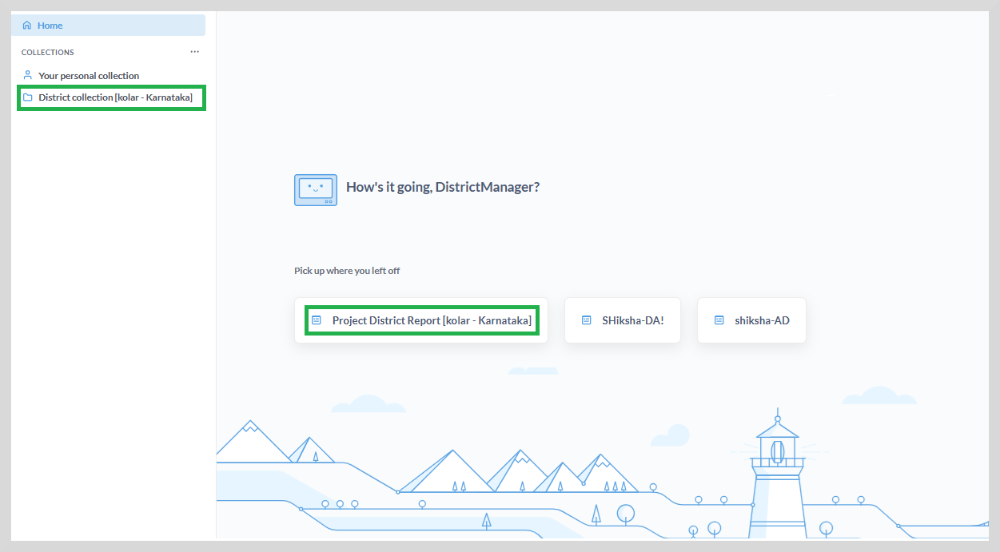
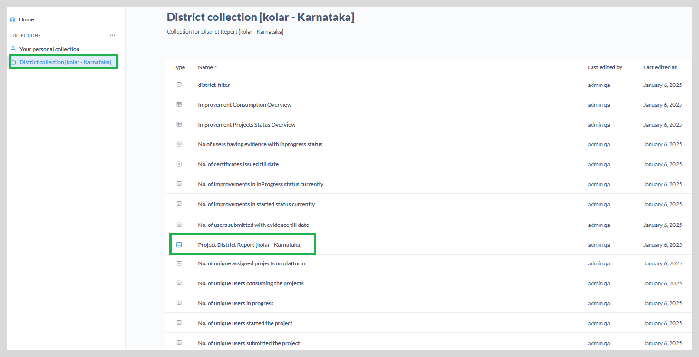
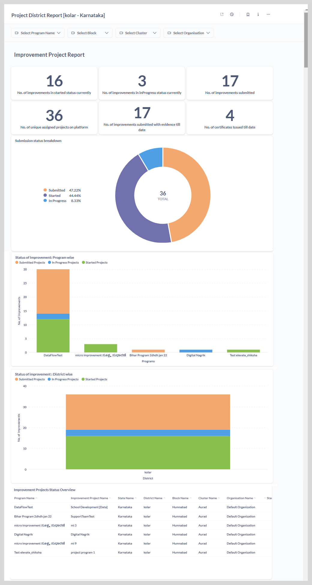

import Admonition from '@theme/Admonition';

# About District Dashboard

This dashboard focuses on program data specific to their assigned district, offering detailed district-level insights.

The left sidebar lists all the reports accessible to the district manager under the **District Collection**,
while the reports that you have already accessed are displayed on the right.

The following figure depicts the Kolar district belonging to the Karnataka state.

## Accessing the District Dashboard

To access the project district report, do one of the following actions:

* Click project district Report. The **Project District Report** page appears.
    
* Go to **District Collection**, and then click **Project District Report**.

The dashboard provides an up-to-date view of the various projects carried out at the district level.

<Admonition type="tip">   
    To view the entire dashboard, scroll down using the vertical scrollbar.
    </Admonition>

You can view the following reports on the district dashboard:

1. ** Improvement Project Report** <a href="dtimprovementreport"> click here to learn more </a>

2. ** Improvement Consumption Report** <a href="dtimpconsumption"> click here to learn more </a>

3. ** Unique User Improvement Project Report** <a href="dtuniqueuser"> click here to learn more </a>

You can do the following actions:

* View the reports as graphs or tabular format. See <a href="visualization"><b>Visualization</b></a> to learn more.

* View and download the reports in CSV or XLSX formats. See <a href="downloadreports"><b>Download Reports</b></a> to learn more.

* View and filter the reports using a combination of filters. See <a href="filter"><b>Filtering the Reports</b></a> to learn more.
