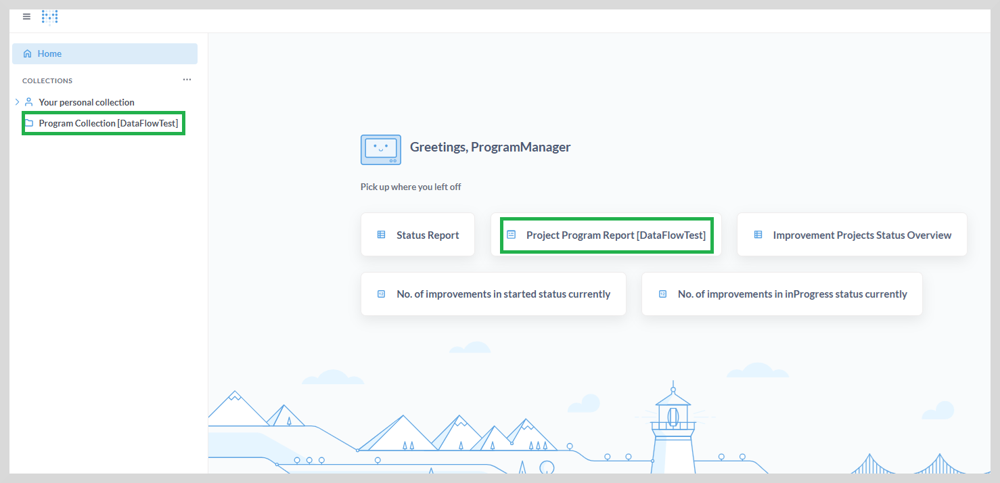
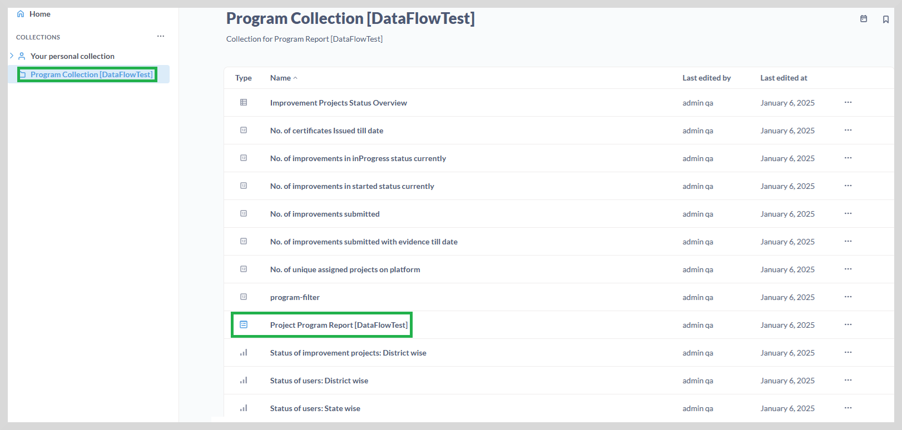
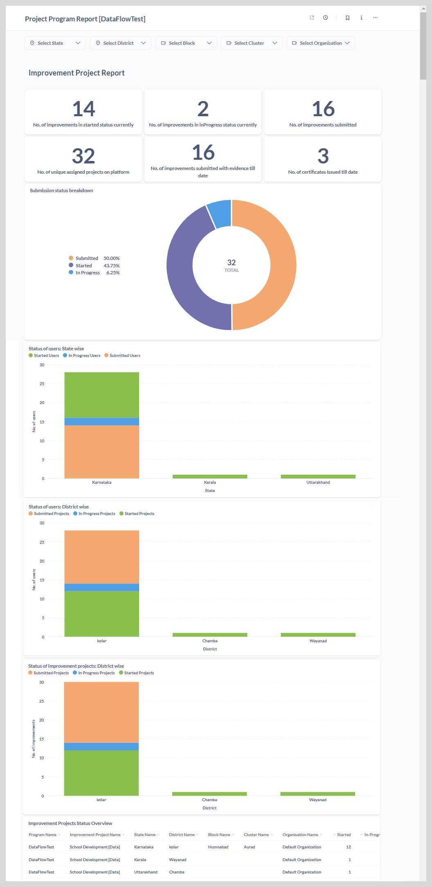

import Admonition from '@theme/Admonition';

# Project Program Report [program name]

After logging in to reports, the **Project Program Report** appears.
This dashboard offers insights specific to their assigned programs, with drill-down access across states, districts, blocks, and clusters where the programs are implemented.

The left sidebar lists all the reports accessible to the program user under the **Program Collection**,
while the reports that you have already accessed are displayed on the right.

## Accessing the Program Dashboard

To access the project program report, do one of the following actions:

* Click **Project Program Report**. The **Project Program Report** page appears.
    
* Go to the **Program Collection**, and then click **Project Program Report**. 

The dashboard provides an up-to-date view of the program status across different organizations
at state, district, block, and cluster level.

<Admonition type="tip">   
    To view the entire dashboard, scroll down using the vertical scrollbar.
    </Admonition>

You can view the following reports on the dashboard:

1. **Improvement Project Report**

    <Admonition type="info">
    
For more information on improvement project report, see <a href="pmimpprojectstatusoverview">Improvement Project Report </a>.

    </Admonition>
    

2. **Task Report**

    <Admonition type="info">
    
For more information on task report, see <a href="pmtaskreport">Task Report </a>.

    </Admonition>
    

3. **Status Report** 

    <Admonition type="info">
    
For more information on status report, see <a href="pmstatusreport">Status Report </a>.

    </Admonition>
    

You can do the following actions:

* View the reports as graphs or tabular format. See <a href="visualization"><b>Visualization</b></a> to learn more.

* View and download the reports in CSV or XLSX formats. See <a href="downloadreports"><b>Download Reports</b></a> to learn more.

* View and filter the reports using a combination of filters. See <a href="filter"><b>Filtering the Reports</b></a> to learn more.

