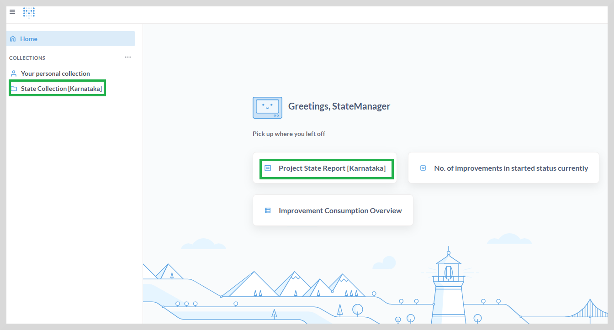
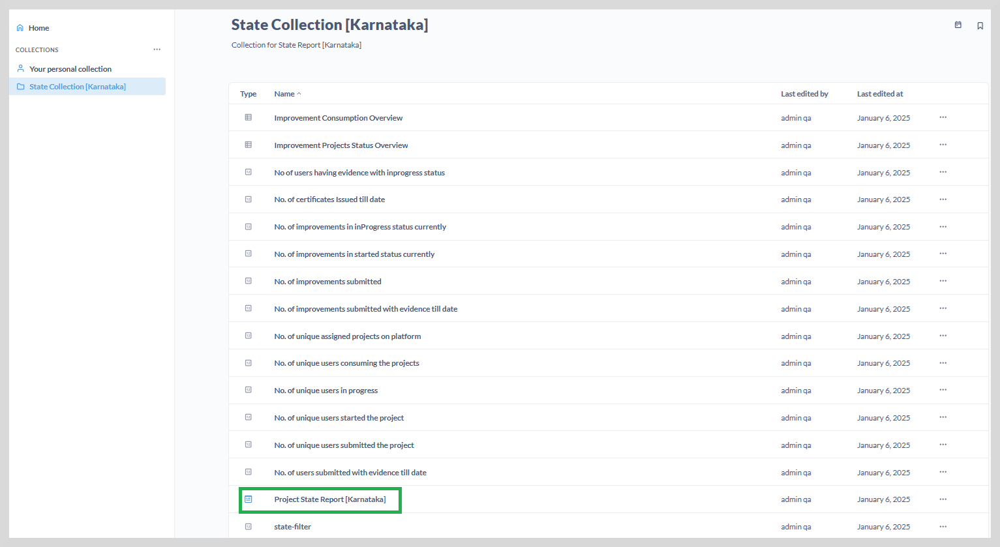
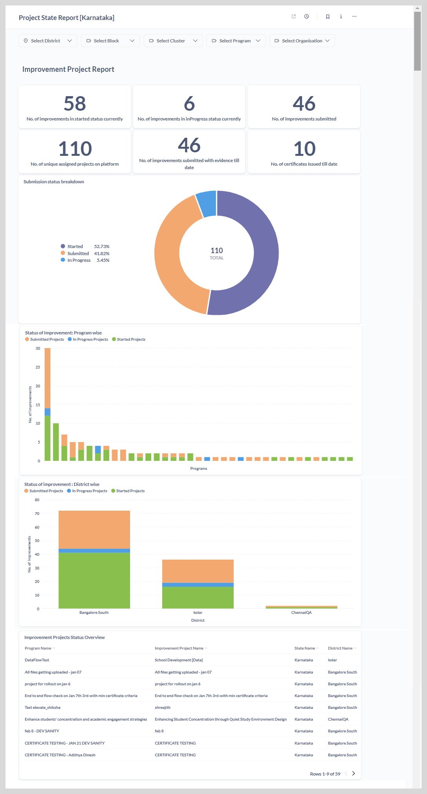

import Admonition from '@theme/Admonition';

# State Dashboard

This dashboard delivers information on all programs within their assigned state, providing state-level drill-down insights.

This is the landing page you see as soon as you log in to the reports. 

The left sidebar lists all the reports accessible to the state manager under the **State Collection**,
while the reports that you have already accessed are displayed on the right.

## Accessing the State Dashboard

To access the project state report, do one of the following actions:

* Click project state Report. The **Project State Report** appears.
    
* Go to the **State Collection**, and then click **Project State Report**.

The dashboard provides an up-to-date view of the program status across different organizations
at  district, block, and cluster level.

<Admonition type="tip">   
    To view the entire dashboard, scroll down using the vertical scrollbar.
    </Admonition>

You can view the following reports on the State dashboard:

1. **Improvement Project Report** <a href="stimprovement"> click here to learn more </a>

2. **Improvement Consumption Report** <a href="stconsumption"> click here to learn more </a>

3. **Unique User Improvement Project Report** <a href="stuniqueuser"> click here to learn more </a> 

You can do the following actions:

* View the reports as graphs or tabular format. See <a href="visualization"><b>Visualization</b></a> to learn more.

* View and download the reports in CSV or XLSX formats. See <a href="downloadreports"><b>Download Reports</b></a> to learn more.

* View and filter the reports using a combination of filters. See <a href="filter"><b>Filtering the Reports</b></a> to learn more.
 

