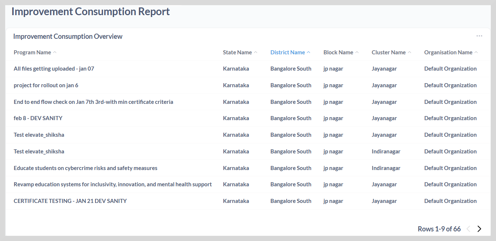
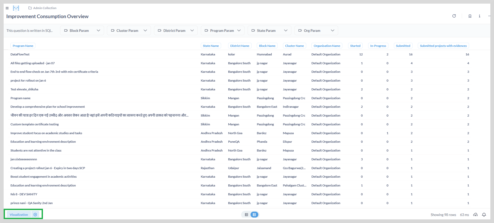

# Improvement Consumption Report

The improvement consumption report provides details of the programs that are consumed by
different organizations across different states.

You can track the status of every program, including those that are started, in-progress, and submitted.

Using the visualization option, you can display the data in graphs or charts.
This will give actionable insights, ensuring that projects stay on track, goals are met, and continuous improvement is achieved.

