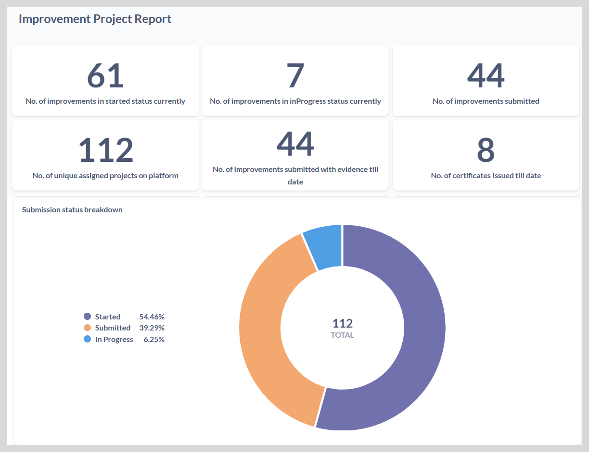
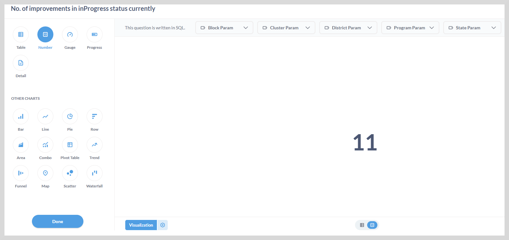

# Improvement Project Report

This report provides you a quick summary of the number of projects that have been started, ongoing, and submitted by various 
organizations at state, district, block, or cluster levels.

The big numbers on the top of the dashboard represent the project status and the user status with their details below.

On the improvement project report page, you can view the following insights about the project:

* Number of improvements that are in the started, progress, or submitted status.

* Submission Status breakdown: View the project status breakdown in percentage or number format.

* Status of Improvement: Program-wise, State-wise, and District-wise.

* Improvement Project Status Overview: View insights about the projects that have been started, ongoing, and submitted.

## Big Numbers on the Dashboard

The big number on the dashboard provides the total number of recent changes or updates
that have occurred across all projects that have been implemented so far. 

You can explore the data in detail using the visualization option.

