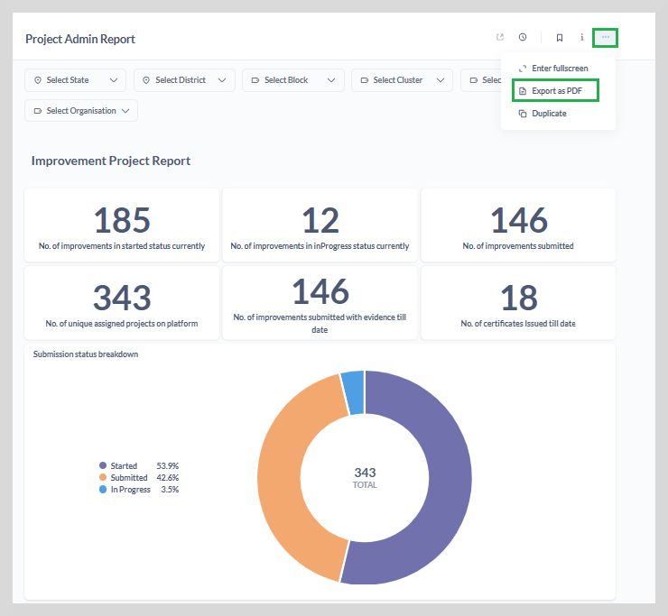
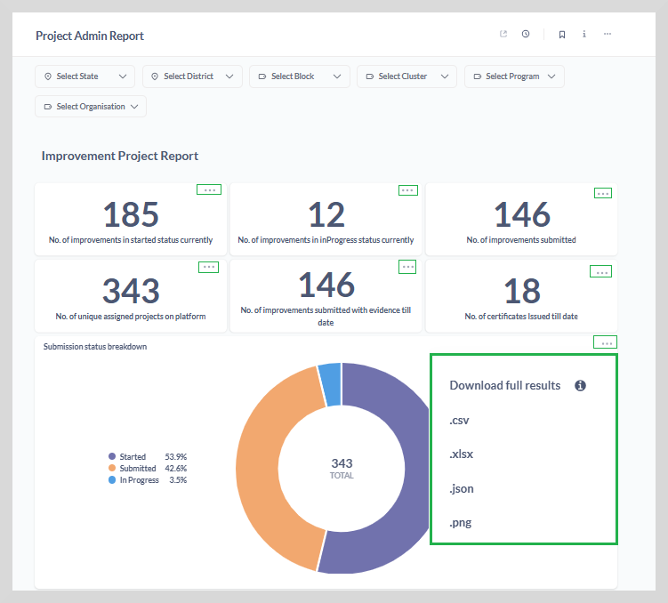
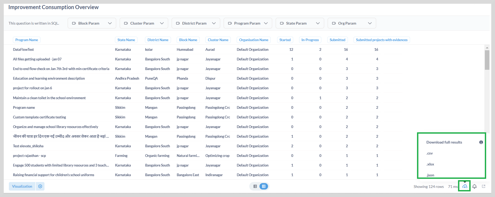

import Admonition from '@theme/Admonition';

# Download Reports

The download report option allows you to download the entire dashboard and individual reports in different formats such as CSV, XLSX, JSON, and .PNG.

**To download the entire dashboard, do as follows:**

1. Click on the three dots icon on the upper-right corner of the dashboard.

2. Select **Export as PDF** to download the entire dashboard in PDF format.

## Download Individual Reports

There are two ways to download individual reports.

**To download a report from the dashboard:**

1. On the dashboard, point to the upper-right corner of the specific report that you want to download. You will see a three-dots icon.

2. Click on the dots to display the report formats. 

3. Select the required file format to download the report.

    <Admonition type="note">
    
Hover over the big number reports to display the three dots icon to download the report that you want.

    </Admonition>
    

**To download a report from the report page:**

* You can download the report using the **Download** option given at the lower-right corner of the report page as shown in the following figure.

    <Admonition type="note">
    
To access individual reports, click the specific report on the dashboard
    or on the report collections available on the home page.

    </Admonition>
    

