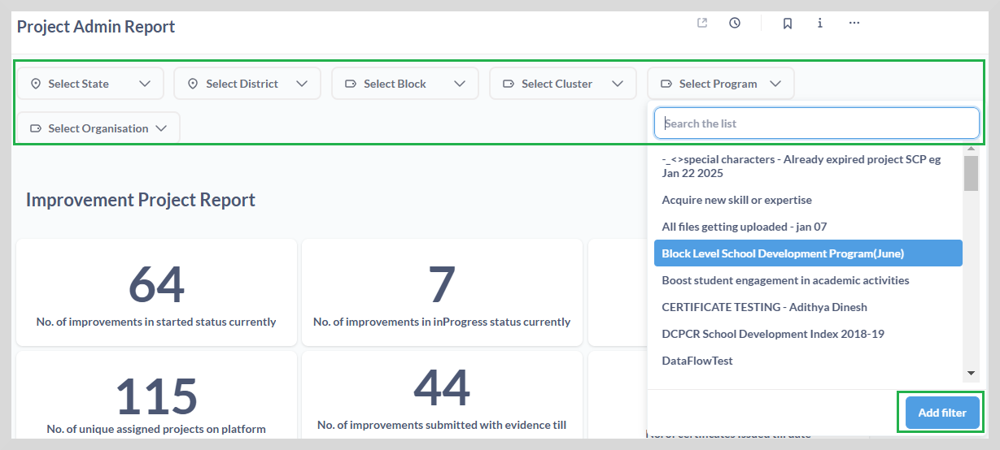
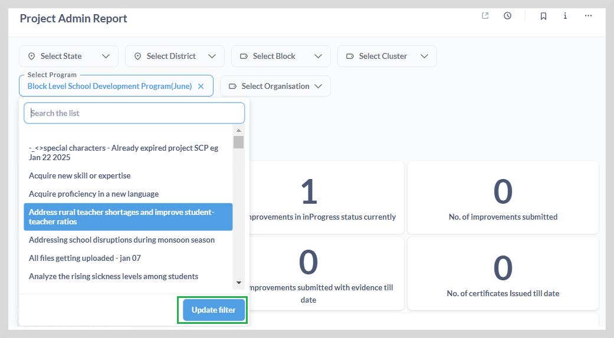
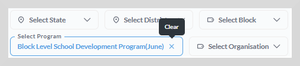

# Filtering the Reports

The filter option is available on all the dashboards. Select the desired filter from the filter dropdown to retrieve the data suiting to your need.
You can filter the data using a combination of filters.

## Applying and Updating Filters

**To apply a filter do as follows:**

1. Select the relevant filter from the filter dropdown given at the top of the dashboard.

2. For example, to filter by program category, select the program from the **Select Program** dropdown.

3. Click **Add Filter**. The data is displayed based on the criteria you have selected.

You can change the filter without removing the applied filter.

**To update a filter:**

1. Click the **Select Program** dropdown and then select the program that you want to filter.

2. Click **Update filter**.

**To clear a filter:**

* Click **clear** to clear the filter.

