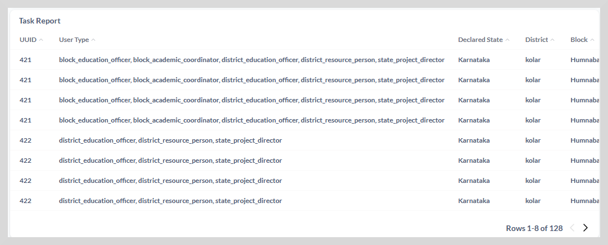

# Task Report 

This report provides task details for improvement projects in a program.
Details such as program name, project name, project start date, project completion date, project duration,
project status, task details, and project-level and task-level evidence are shown in this report.

