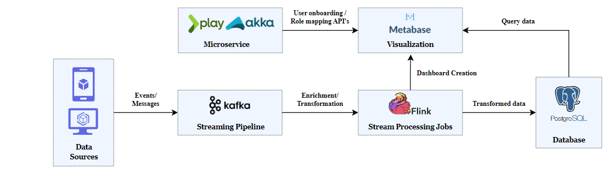

# Reports Architecture

Report consists of two main components:

1. Data Pipeline

    * Extracts data in real-time from Elevate core capabilities, such as Projects, Mentor, and Observations and Surveys.
    * Processes and flattens data into a structured format for reporting.

2. Visualization Tool

    * Uses Metabase, an open-source data visualization tool.
    * Offers flexibility, clean UI, and API integrations for custom dashboards.

