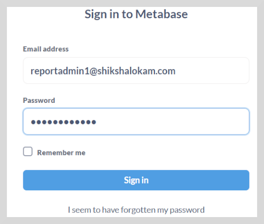
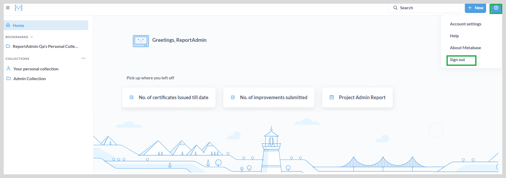

import Admonition from '@theme/Admonition';

# Signing in to Reports

After receiving the application's link, you need to enter your email address and password to sign in to reports.

<Admonition type="note">

To manage the dashboard for different user roles; the application has screens specific to the administrator,
 state manager, district manager, and program manager. 

</Admonition>

**To sign in to reports, do as follows:**

1. Enter your **Email** and **Password**.

2. Click **Sign in**. The **Home** page appears.

## Signing Out

**To sign out, do as follows:**

1. Click the gear icon on the upper-right corner of the **Home** page.

2. Select **Sign out**.
