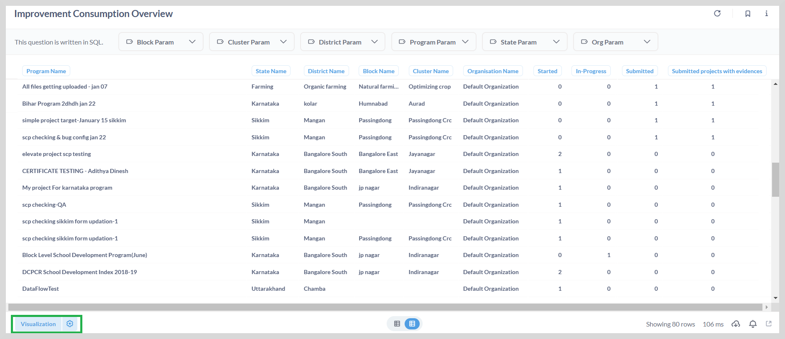
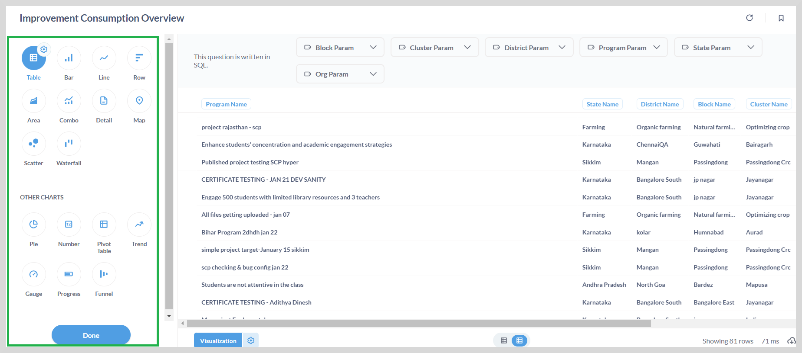
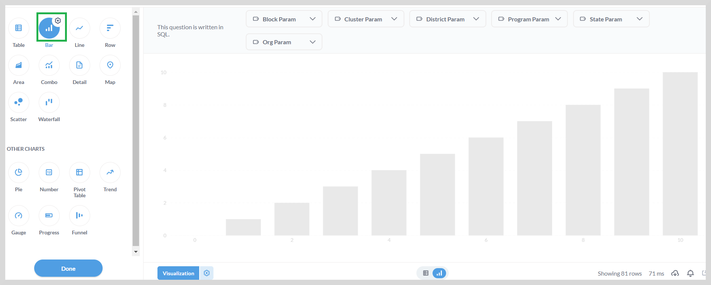
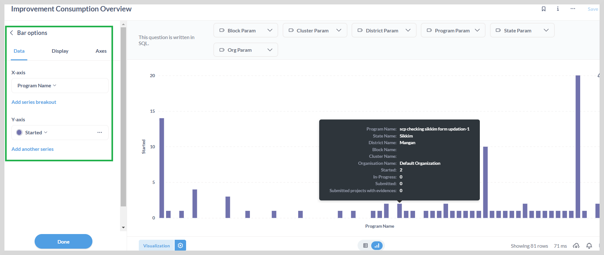

# Visualization

All Elevate data report consists of visualization elements such as graphs, charts, gauges and maps. The data presented on the dashboard
can be displayed in a wide range of graphs and charts.
These visualizations help stakeholders make efficient real-time decisions.

For example, the improvement consumption report provides an overview of the programs that are consumed or utilized by
different organizations across different states.

You can:

* Easily track the usage of these programmes at state, district , block or cluster level.
* View the quantitative statistics of the programmes that have been started, ongoing, or submitted.

## Visualization Options

You can use the visualization option to display the data graphically in charts or graphs. To do this, click **visualization**.
This opens the visualization sidebar as shown in the following figure. 

 The gear icon will display the options available based on the visualization and the data you have.

The gear icon allows you to:

* Specify the X-axis and Y-axis parameters
* Hide or show columns
* Apply conditional formatting

You can change the type of a selected visualization by selecting a different icon.

For example, to display the data on the bar graph, select the **Bar icon** and then click **Done**.

You can select the X-axis and Y-axis values using the gear icon as shown in the following figure.

