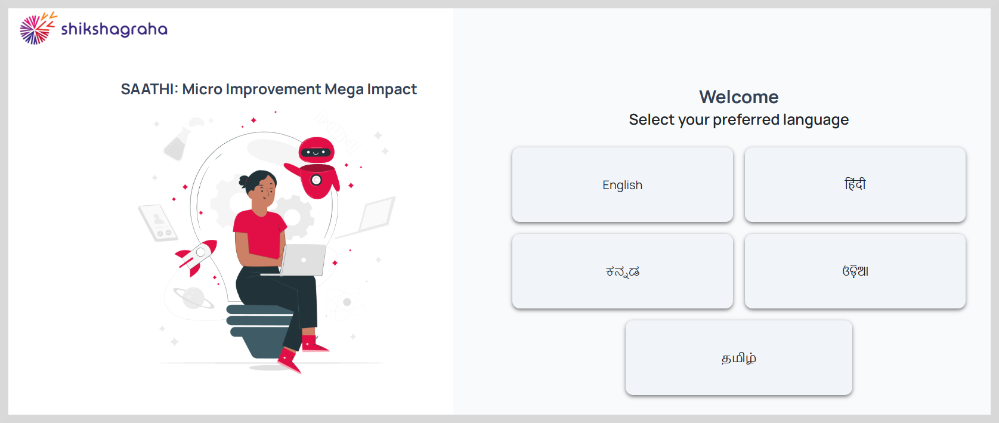
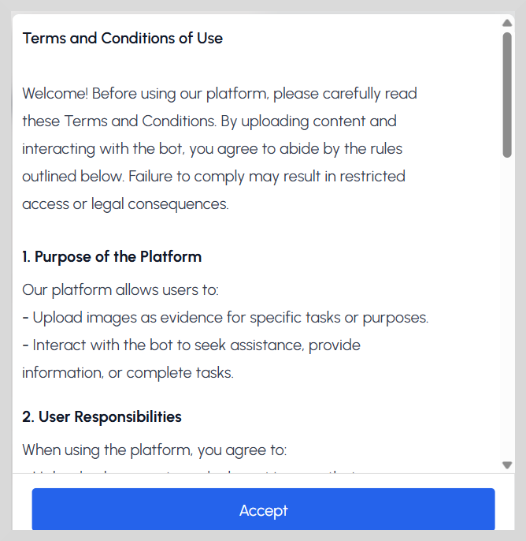
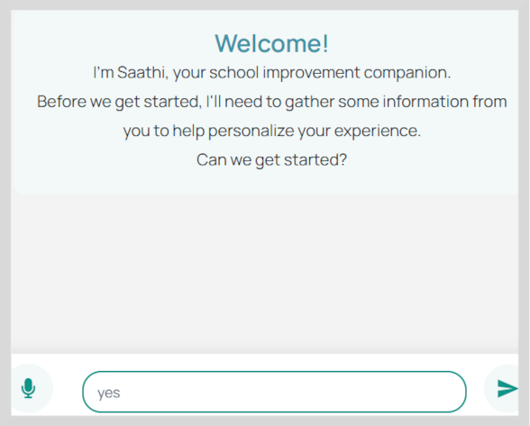
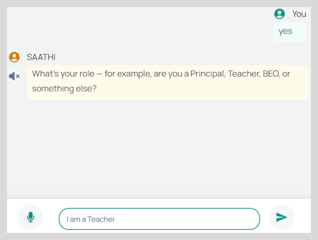

import Admonition from '@theme/Admonition';

# Addressing Challenges and Solutions

1. On the Welcome page, select your preferred language as shown in the following figure.

2. After you select the language, the Terms and Conditions of Use page appears.

3. Click **Accept** on the Terms and Conditions of Use page. The following page appears.

4. Start chatting with Saathi or type your queries in the text box provided.

* To chat with Saathi, click the microphone icon to record and stop recording when finished.

* Type the information in detail in the text box provided and then click send.

