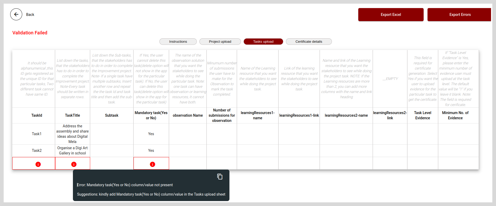

import Admonition from '@theme/Admonition';

# Creating Solutions

You can create and publish new Solutions using the pre-designed templates. The data provided by the Users in the template is validated for correctness in accordance with the instructions specified in the template. 
After checking the correctness of the data, you can create the Solutions using the portal.

The following section describes how to create a Solution using the Template Download and Template Upload option.

**To download a template, do as follows:**

1. On the **Template Download** tile, select the relevant template from the **Select Template** dropdown and then click **Download**.

    

2. Fill in the relevant details as per the instructions given in the downloaded template.

3. Save the template.

After you save the template you can upload and validate the data using the **Template Upload** option.

## Validate the Template and Create a Solution

**To validate and create a Solution, do as follows:**

1. On the **Template Upload** tile, select the Solution template from the **Select Solution type** dropdown.

    

2. Click **Validate** to check the correctness of the data as per the instructions given in the template.

3. If the data you entered is valid, then you can either keep the template ready for future use or click **Create** to create a Solution. A message appears indicating that the Solution is created successfully.

    

<Admonition type="note">

<b>Create</b> is a two-step process that involves validating the template first and then creating the Solution.

</Admonition>

 

4. If the data is not valid, then a message appears indicating that the validation has failed as shown in the following figure. You will also 
   see a red **i** icon  in the cells that contain invalid data.

    

5. Click the **i** icon to see the error details and suggestions for correcting the error.

6. Correct the invalid data and then follow the steps from 1 to 3 to create a Solution.

## Export to Excel

You can export only errors or entire data to Excel.

* To export entire data to Excel, click **Export Excel**.

* To export only the errors to Excel, click **Export Errors**.
