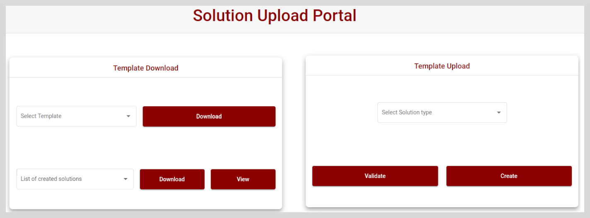

# Overview

The Solution Upload Portal allows you to download the Projects, Programs, and Observations or Surveys templates and validate the data entered in the template in accordance with the instructions specified in the template.
This helps to reduce errors, save time, and improve the accuracy of the data.
This can be implemented standalone or integrated into the adopters' existing sites, such as  Karmayogi Bharat.

You can create a Solution using any one of the following methods:

* Implementation script
* Solution Upload Portal
* Self Creation Portal

The following section describes how to create a Solution using the Solution Upload Portal.

# Setting up Templates for Creating Solutions

You can perform the following actions using the Solution Upload Portal:

* Download any **Program**, **Project**, **Observation** or **Survey** template.
* Fill in the relevant data in the template.
* Automatically validate the data for any errors.
* Create a Solution from the validated template.

 To learn more about Solution templates, see <a href="download-upload templates"> Download/Upload templates </a>.
