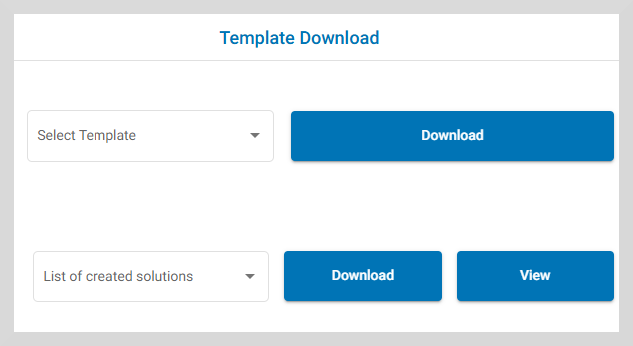
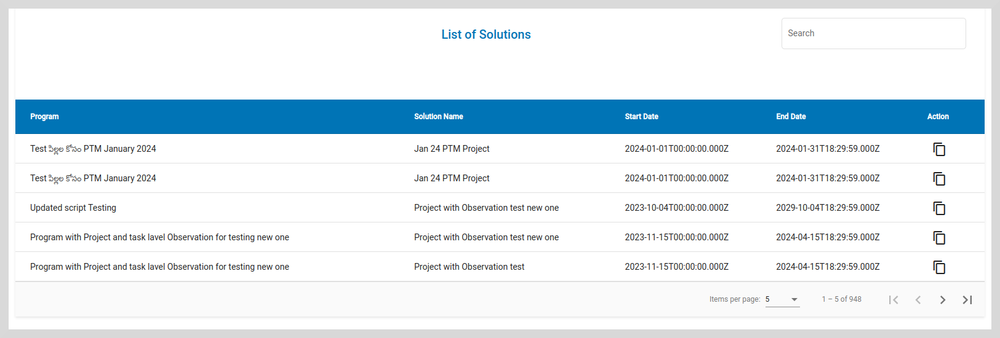
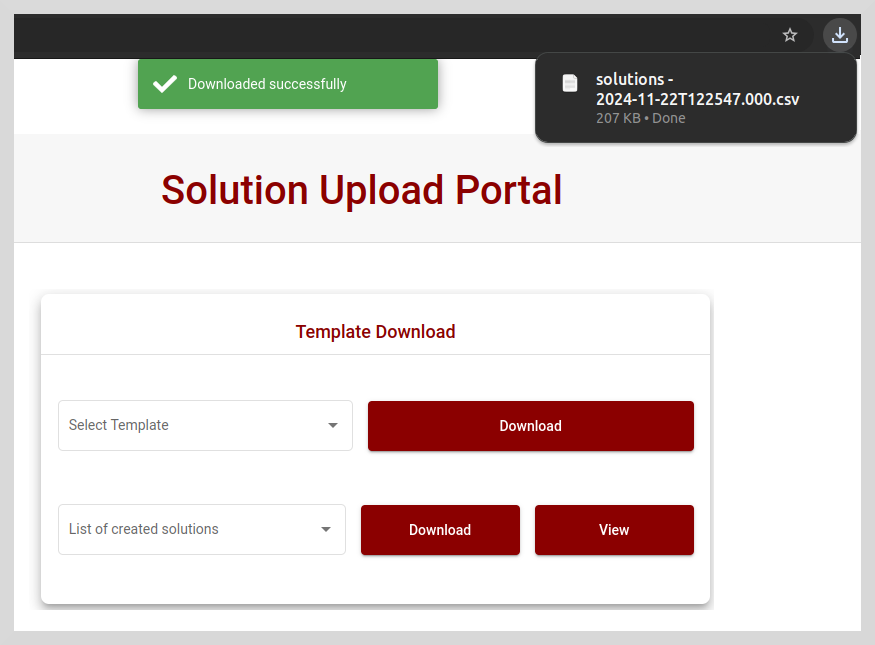

# View Created Solutions

You can view the list of Solutions created, Solution start date, and Solution end date for a particular resource, such as a program, project, or observation or survey.

You can either download the created Solutions in **csv** format or view them directly on the screen.

**To view a Solution:**

1. On the **Template Download** tile, select a Solution from the **List of created solutions** dropdown.

    

2. Click **View**. The list of created Solutions appears.

    

**To download a Solution:**

1. On the **Template Download** tile, select a solution from the **List of created solutions** dropdown.

2.  Click **Download** to download the solutions list as a **csv** file.

    

