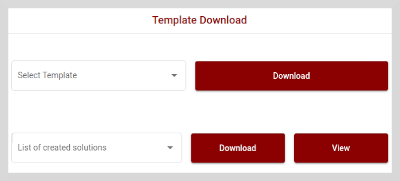
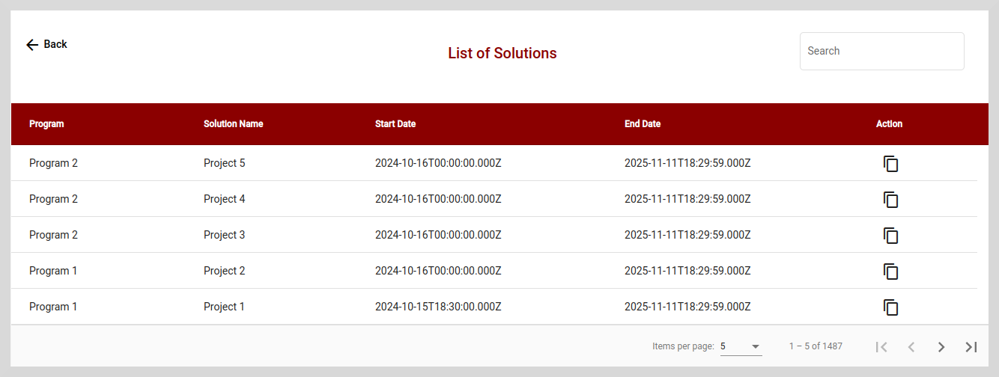

# View Created Solutions

You can view the list of Solutions created, Solution start date, and Solution end date for a particular resource, such as a Program, Project, or Observation or Survey.

You can either download the created Solutions in **csv** format or view them directly on the screen.

**To view the list of created Solutions:**

1. On the **Template Download** tile, select a Solution from the **List of created solutions** dropdown.

    

2. Click **View**. The list of Solutions page appears.

    

**To download the list of created Solutions:**

1. On the **Template Download** tile, select a Solution from the **List of created solutions** dropdown.

2.  Click **Download** to download the Solutions list as a **csv** file.

    

