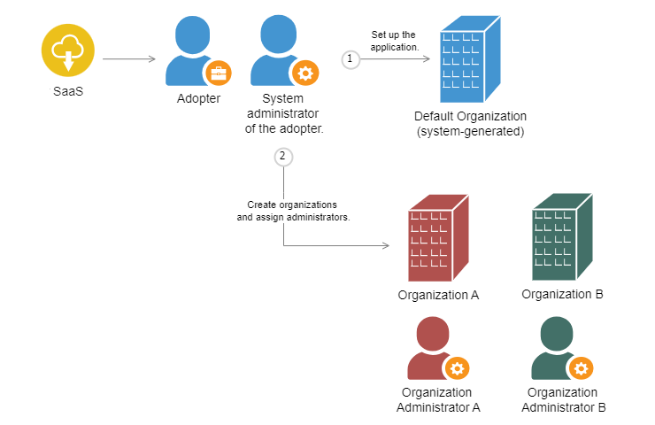

import Admonition from '@theme/Admonition';

# About Organizations

To set up a multi-tenant architecture, adopters can:

1. Set up the application using the microservices.

2. Create multiple organizations and assign administrators for each organization.

## Default Organization

After setting up the application, a **Default** organization is created. Users who are not part of any organization are added to **Default** and the system administrator acts as the organization administrator.

## Assigning Users to Organizations

The user's organization is detected based on the organizational domain in the email ID.

If the organization uploads email IDs to the platform, the users would receive email invites. The administrator can pre-register email IDs that belong to corporate as well as public domains. After signing up, such users are detected as organizational users in the application.

  
    <Admonition type="note">
    
After signing up, if the email ID is not registered by the organization or if it does not belong to the organizational domain, the user is added to the <b>Default</b> organization.

    </Admonition>

