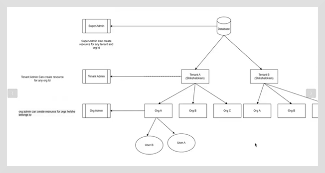

# Overview

A tenant represents a customer or a company on a SaaS platform associated with a unique domain name and tenant ID.

Tenants are logically distinct from one another in terms of their data, users, permissions, settings, and configurations. 
Tenants enable companies to share infrastructure and databases across different organizations, making it more secure and cost-effective.

Types of Tenancy:

1. Single-Tenant architecture: Every customer gets a dedicated database and application instance.

2. Multi-tenant architecture: All customers share the same application and database; however each customer will have their own isolated data and
     configuration.

A multi-tenant architecture uses a single instance of the software application to serve multiple customers/tenants.
In this model, all tenants share common features like security, business logic, and resource management.
Since resources are shared among multiple tenants, they are more cost effective and scalable.

Within a tenant, the organization structure exists.
For example, each tenant can have a number of organizations, like Org A, Org B, Org C, and so on, under it.
 The tenants will have their own data and configurations within the system.

 

 1. Data Segregation: Uses a shared database; however, the data is segregated at the application or database layer using tenant IDs.
  Data is not shared across tenants.
2.  Every user can be associated with multiple organizations that are part of the same tenant.

3. Users who are part of one organization within a tenant can access data from other organizations through organization policies.

