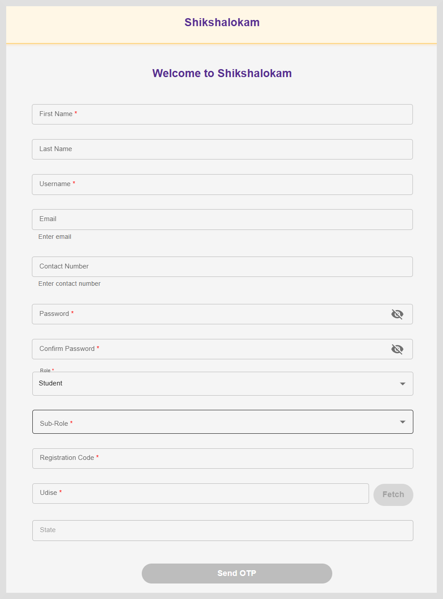

import Admonition from '@theme/Admonition';

# Registering Users

After receiving the application's link, you must register to create a user account using the registration form.
This registration form is configurable at the tenant level.

  <Admonition type="note">
  
  The registration form shown here is a sample form for educational purposes.
  Sometimes you may need to add or remove fields when using Elevate capabilities to meet your organization's specific needs.
  In such cases, you can add or remove the fields. To learn more about how to add or remove fields, see Create Entity Types and Entities.
  
    </Admonition>

From the Login page, click <b>Register</b>. The registration form appears.

To register a user do as follows:

1. Enter your details:

    * <b>First Name</b>
    * <b>Last Name</b>
    * <b>Username</b>
    * <b>Email</b>
    

        <Admonition type="note">
        
Enter a valid email ID.

        </Admonition>
    

    * <b>Contact Number</b>
    * <b>Password</b>

    

        <Admonition type="note">
        
Your password must be at least 8 characters long and include uppercase, lowercase, number, and special character.

        </Admonition>
    

    * Re-enter the password in the <b>Confirm Password</b> text box.

2. Select the appropriate role from the student dropdown. You can select more than one role.  

3. Select the Sub-Role. This field does not appear for Parents Role.  

4. Enter the Registration code.  

5. Enter the Udise code. Click on <b>Fetch</b> to get the state, district, block, cluster, and school details.

 
      
    
6. Click <b>Send OTP</b>. An OTP is sent to your registered email ID.

7. Enter the OTP. The Home page appears.

    <Admonition type="tip">   
    
To receive a new OTP, click <b>Resend OTP</b>.

    </Admonition>

