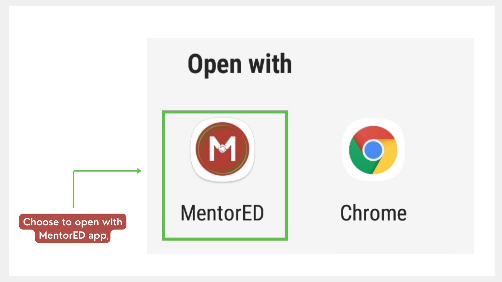
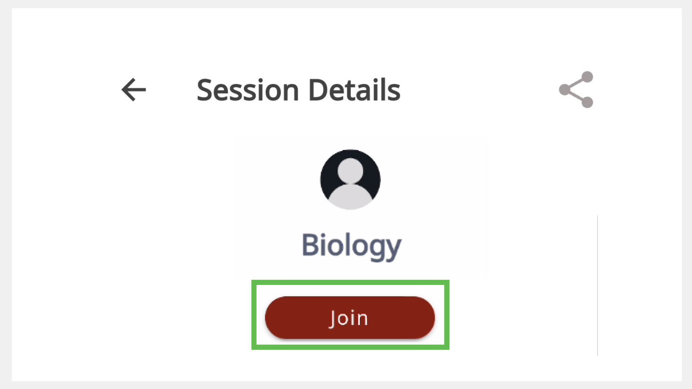

import PartialExample from './_mentored.mdx';

# Using a Shared Link to Join a Session
You can join mentoring sessions through a shared link.

> :::tip 
> Users who have not registered on <PartialExample mentored /> yet, should do the following actions:
>
> 1. Install the application.
>
> 2. [Sign up](signing-up-as-a-mentee.md).
>
> 3. [Update your profile](creating-and-managing-mentee-profile.md).
>
> 4. [Enroll for sessions](enrolling-for-a-session.md).

You can join the session through a shared link in one of the following ways:
* Using the <PartialExample mentored /> application
* Using a browser
  
## Using the <PartialExample mentored /> Application

1. Tap the shared link and select **<PartialExample mentored />**. 

   

   
2. Tap **Join**.

   >:::note
   >If you haven't enrolled for the session yet, tap **Enroll**.

   

## Using a Browser

Tap the shared link and select a browser. The BigBlueButton meeting window appears on your browser. 

> :::info 
> * To know more about enrolling for a session and cancelling your enrollment, see [Enrolling for a Session](enrolling-for-a-session.md). 
> * To know more about joining a BigBlueButton meeting, see [Setting up a BigBlueButton Meeting](joining-a-session.md).

  
   
