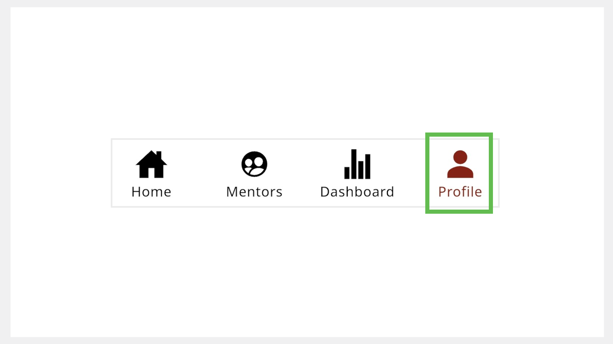

# Creating and Managing a Mentee Profile

On the Profile page, you can do the following actions:

* Update your profile.
* View the number of sessions attended.

To view the Profile page, go to the **Profile** tab.

## Updating your Profile

> :::note 
> You can use the application only after updating your profile. 

**To update your profile, do as follows:**

1. On the Profile page, tap **Edit profile**.

    

2. Enter your details.
    
    
    
3. If you want to add a profile picture, tap **Add Image**. Select **Take Photo** or **Choose from library**.

4. Tap **Submit**. The profile details are updated.