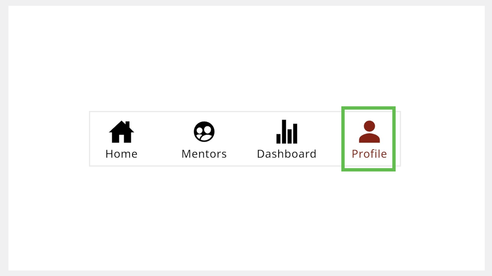
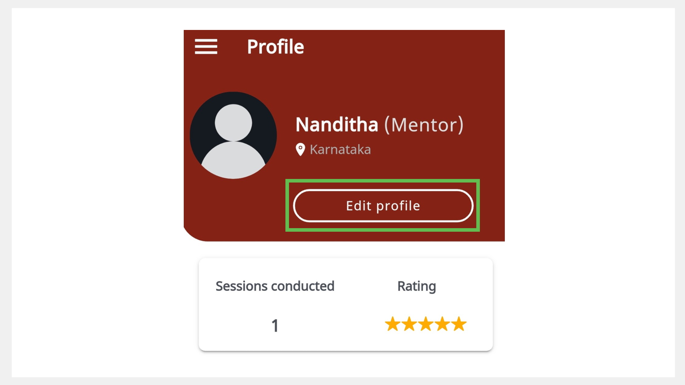

# Creating and Managing a Mentor Profile

On the Profile page, you can do the following actions:

* Update your profile details to help mentees get to know you.
* View the number of sessions conducted. 
* View your session ratings.

To view the Profile page, go to the **Profile** tab.

## Updating your Profile

> :::note 
> You can use the application only after updating your profile. 

**To update your profile, do as follows:**

1.  On the Profile page, tap **Edit profile**.

    

2.  Enter your details.

    

3.  If you want to add a profile picture, tap **Add image**. Select **Take Photo** or **Choose from Library**.

4.  Tap **Submit**. The profile details are updated.