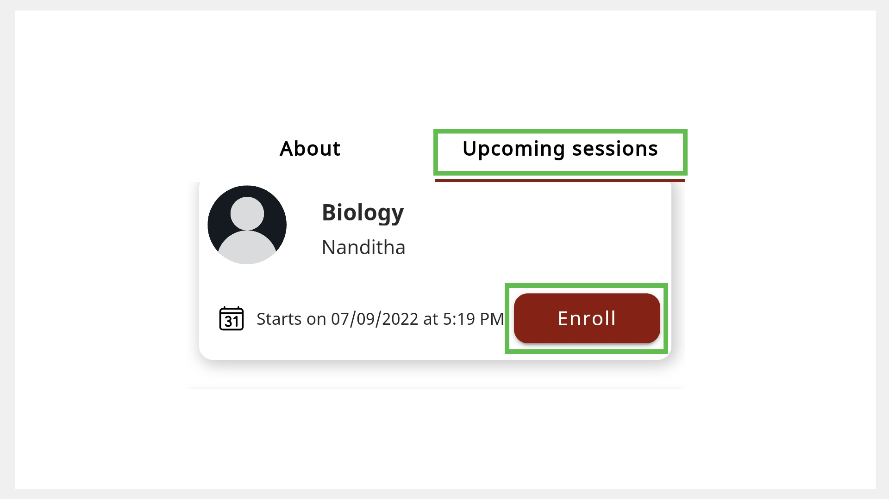

# Enrolling for a Session

You can explore and sign up for mentoring sessions.

>:::note
>You can enroll for an ongoing session, which appears as *Live* on the Home page.

You can enroll for a session in one of the following ways:
* Using the **All sessions** tab
* Using the mentor profile
* Using the Session Details page
* Using the **Search** bar 

## Using the All Sessions Tab

1. On the Home page, go to the **All sessions** tab. 

2. Find a session of interest.

3. Tap **Enroll**. The enrolled sessions are listed on the **Enrolled sessions** tab of the Home page.

     

## Using the Mentor Profile

>:::info
>See [Mentor Directory](mentor-directory.md) to learn more about accessing the mentor profile.

**To enroll for a session using the mentor profile, do as follows:**

1.	On the Mentor Profile page, go to the **Upcoming sessions** tab.

2.	Tap **Enroll**. The enrolled sessions are listed on the **Enrolled sessions** tab of the Home page.

    

## Using the Session Details Page

1. Find a session from the **All sessions** tab or the Mentor Profile page.

2. Tap the session tile to view the Session Details page.

3. Tap **Enroll**. The enrolled sessions are listed on the **Enrolled sessions** tab of the Home page.

    
 
## Using the Search Bar

1. In the **Search** bar of the Home page, tap the **All Sessions** tab.

    

2. Type the session name and tap the **Search** button. 

3. Tap the session tile to view the Session Details page.

4. Tap **Enroll**. The enrolled sessions are listed on the **Enrolled sessions** tab of the Home page.

    

## Cancelling Your Enrollment

> :::note 
> You can cancel your enrollment if the mentor has not started the session.

**To cancel your enrollment, do as follows:**

1.	On your Home page, go to the **Enrolled sessions** tab.

2. Tap the session tile.

3. Tap **Cancel**. The session is removed from the **Enrolled sessions** tab of the Home page. 

    

