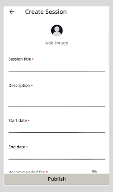
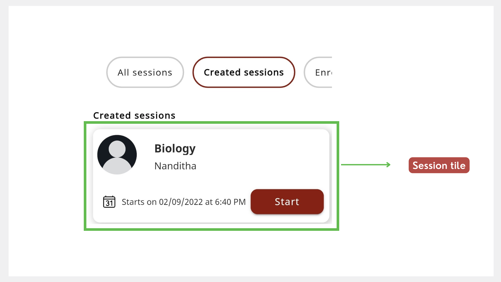
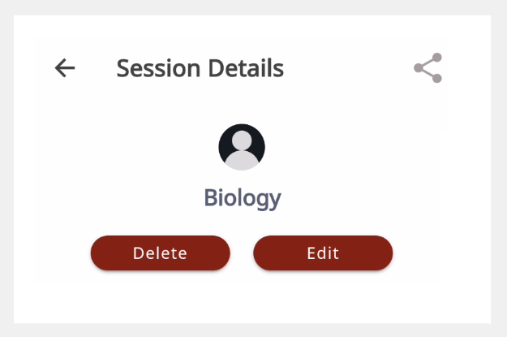
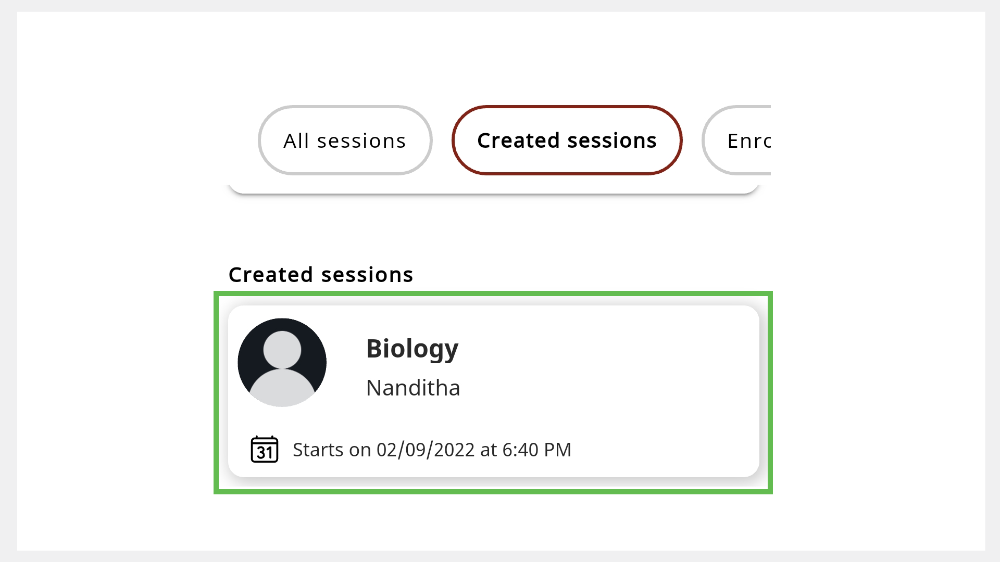

# Setting up a Session

You can create and manage mentoring sessions.

**To create a session, do as follows:**

1.  On the Home page, go to the **Created sessions** tab.

2.  Tap **Create session**.

3.  Enter the session details.

    > :::note 
    > * The session duration should be at least 30 minutes.
    > * While setting the end time, set an extra time of at least 10 minutes to account for any delays during the session.

    

4.  If you want to add a profile picture, tap **Add image**. Select **Take Photo** or **Choose from library**.

5.  Tap **Publish**. The new session appears on the **Created sessions** tab of the Home page.

    

    > :::tip
    > To create more sessions, tap **Create session** and repeat steps 1 to 5.

## Editing a Session

1. To edit the session details, tap the session tile to view the Session Details page.

    

2. Tap **Edit**.
3. Change the session details and tap **Publish**. The session details are updated.

## Deleting a session

To delete the session, tap the session tile and tap **Delete**.

The session is cancelled and is removed from the **Created sessions** tab of the Home page.

## Deleting Your Completed Sessions  

1. To delete your completed sessions, tap the session tile.

    

2. Tap **Delete**. The completed session is removed from the **Created sessions** tab.

